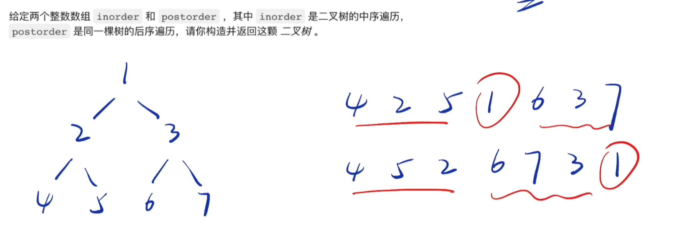

---
tag:
 - DS
sticky: 200
---

# 题型汇总 🔥

1. 算法的复杂度分析。
2. 排序算法，以及他们的区别和优化。
3. 数组中的双指针、滑动窗口思想。
4. 利用 Map 和 Set 处理查找表问题。
5. 链表的各种问题。
6. 利用递归和迭代法解决二叉树问题。
7. 栈、队列、DFS、BFS。
8. 回溯法、贪心算法、动态规划。

## 滑动窗口问题

### [3. 无重复字符的最长子串](https://leetcode.cn/problems/longest-substring-without-repeating-characters/description/?favorite=2cktkvj)

给定一个字符串 `s` ，请你找出其中不含有重复字符的 **最长子串** 的长度。

> 利用set()自动去重的特点

```js
/**
 * @param {string} s
 * @return {number}
 */
var lengthOfLongestSubstring = function(s) {
    if (s.length===0) return 0
    let j = 0, maxLen = 0
    let set = new Set()
    // 遍历字符串
    for (let i=0;i<s.length;i++) {
        // 每次往set里添加元素时, 都要先使用while循环从头删除set里的元素, 直到set里没有当前要添加的元素为止
        while(set.has(s[i])) {
            set.delete(s[j])
            j++ // j指针是关键
        }
        set.add(s[i])
        maxLen = Math.max(maxLen, set.size)
    }
    return maxLen
};
```

## 链表问题

### [反转链表](https://www.nowcoder.com/practice/75e878df47f24fdc9dc3e400ec6058ca?tpId=308&tqId=23286&ru=/exam/oj&qru=/ta/algorithm-start/question-ranking&sourceUrl=%2Fexam%2Foj%3Fpage%3D1%26tab%3D%E7%AE%97%E6%B3%95%E7%AF%87%26topicId%3D308)

> 三指针：p1,p2,tmp
>
> 使用p2遍历整个链表

```js
/*function ListNode(x){
    this.val = x;
    this.next = null;
}*/
function ReverseList(pHead)
{
    let p1 = null
    let p2 = pHead
    while (p2) {
        let tmp = p2.next
        p2.next = p1
        p1 = p2
        p2 = tmp
    }
    return p1
}
module.exports = {
    ReverseList : ReverseList
};
```

### [删除链表的节点](https://www.nowcoder.com/practice/f9f78ca89ad643c99701a7142bd59f5d?tpId=308&tqId=2273171&ru=/exam/oj&qru=/ta/algorithm-start/question-ranking&sourceUrl=%2Fexam%2Foj%3Fpage%3D1%26tab%3D%E7%AE%97%E6%B3%95%E7%AF%87%26topicId%3D308)

> 简单，画图理解即可

```js
/*
 * function ListNode(x){
 *   this.val = x;
 *   this.next = null;
 * }
 */
/**
 * 代码中的类名、方法名、参数名已经指定，请勿修改，直接返回方法规定的值即可
 *
 * 
 * @param head ListNode类 
 * @param val int整型 
 * @return ListNode类
 */
function deleteNode( head ,  val ) {
    let dummy = new ListNode()
    dummy.next = head
    let cur = dummy
    while (cur.next.val!==val) {
        cur=cur.next
    }
    cur.next = cur.next.next
    return dummy.next
}
module.exports = {
    deleteNode : deleteNode
};
```

### [合并两个排序的链表](https://www.nowcoder.com/practice/d8b6b4358f774294a89de2a6ac4d9337?tpId=308&tqId=23267&ru=/exam/oj&qru=/ta/algorithm-start/question-ranking&sourceUrl=%2Fexam%2Foj%3Fpage%3D1%26tab%3D%E7%AE%97%E6%B3%95%E7%AF%87%26topicId%3D308)

```js
/*function ListNode(x){
    this.val = x;
    this.next = null;
}*/
function Merge(pHead1, pHead2) {
  let dummy = new ListNode()
  let cur = dummy
  while (pHead1 && pHead2) {
    if (pHead1.val < pHead2.val) {
      cur.next = pHead1
      pHead1 = pHead1.next
    } else {
      cur.next = pHead2
      pHead2 = pHead2.next
    }
    cur = cur.next
  }
  if (pHead1) {
    cur.next = pHead1
  }
  if (pHead2) {
    cur.next = pHead2
  }
  return dummy.next
}
module.exports = {
  Merge: Merge
};

```

### [2. 两数相加](https://leetcode.cn/problems/add-two-numbers/)

> 类比拿草稿纸进行两数相加
>
> - sum先加carry，carry代表进位的数字
> - 再更新下一轮的carry
> - 最后再写当前位的数字，也就是创建结点
>
> 两个链表都遍历完成后，如果carry!==0，则再创建结点

```js
/**
 * Definition for singly-linked list.
 * function ListNode(val, next) {
 *     this.val = (val===undefined ? 0 : val)
 *     this.next = (next===undefined ? null : next)
 * }
 */
/**
 * @param {ListNode} l1
 * @param {ListNode} l2
 * @return {ListNode}
 */
var addTwoNumbers = function(l1, l2) {
    let dummy = new ListNode()
    let carry = 0
    let cur = dummy // 操作cur指针, 实际上是为了改变dummy
    while (l1||l2) {
        let sum = 0
        if (l1){
            sum+=l1.val
            l1=l1.next
        }
        if (l2){
            sum+=l2.val
            l2=l2.next
        }
        sum+=carry // 1.sum先加carry
        carry = Math.floor(sum/10) // 2.再更新carry
        cur.next = new ListNode(sum%10)// 3.再创建节点
        cur=cur.next
    }
    if (carry>0) {
        cur.next = new ListNode(carry)
    }
    return dummy.next
};
```

### [24. 两两交换链表中的节点](https://leetcode.cn/problems/swap-nodes-in-pairs/)

> 虚拟头节点

```js
/**
 * Definition for singly-linked list.
 * function ListNode(val, next) {
 *     this.val = (val===undefined ? 0 : val)
 *     this.next = (next===undefined ? null : next)
 * }
 */
/**
 * @param {ListNode} head
 * @return {ListNode}
 */
var swapPairs = function(head) {
    let dummy = new ListNode()
    dummy.next= head
    let cur = dummy
    while (cur.next!==null && cur.next.next!==null) {
      	// 这6行可以画图理解 
        let n1 = cur.next;
        let n2 = cur.next.next;
        cur.next = n2
        n1.next = n2.next
        n2.next = n1
        cur = n1
    }
    return dummy.next
};
```

## 队列

### [【模板】队列](https://www.nowcoder.com/practice/afe812c80ad946f4b292a26dd13ba549?tpId=308&tqId=2110348&ru=/exam/oj&qru=/ta/algorithm-start/question-ranking&sourceUrl=%2Fexam%2Foj%3Fpage%3D1%26tab%3D%E7%AE%97%E6%B3%95%E7%AF%87%26topicId%3D308)

> 学会readline()的使用

请你实现一个队列。

操作：

push x：将 *x* 加入队尾，保证 *x* 为 int 型整数。

pop：输出队首，并让队首出队

front：输出队首：队首不出队

输入：

```js
6
push 1
pop
front
push 2
push 3
pop
```

```js
const rl = require('readline').createInterface({ input: process.stdin });
var iter = rl[Symbol.asyncIterator]();
const readline = async () => (await iter.next()).value;

void (async function () {
  var line
  let ddyquene = [];
  while (line = await readline()) {
    let [operation,num] = line.split(' ')
    switch (operation) {
      case "push":
        ddyquene.push(num);
        break;
      case "pop":
        if (ddyquene.length) {
          console.log(ddyquene.shift());
        } else {
          console.log("error");
        }
        break;
      case "front":
        if (ddyquene.length) {
          console.log(ddyquene[0]);
        } else {
          console.log("error");
        }
        break;
    }
  }
})();
```

### [【模板】循环队列](https://www.nowcoder.com/practice/0a3a216e50004d8bb5da43ad38bcfcbf?tpId=308&tqId=2372963&ru=/exam/oj&qru=/ta/algorithm-start/question-ranking&sourceUrl=%2Fexam%2Foj%3Fpage%3D1%26tab%3D%E7%AE%97%E6%B3%95%E7%AF%87%26topicId%3D308)

```js
const rl = require("readline").createInterface({ input: process.stdin });
var iter = rl[Symbol.asyncIterator]();
const readline = async () => (await iter.next()).value;

void (async function () {
    // Write your code here
    const line = await readline();
    const [n, q] = line.split(" ").map(Number);
    let heap = [];
    for (let i = 0; i < q; i++) {
        let newL = await readline();
        let [operate, num] = newL.split(" ");
        if (operate === "push") {
            heap.length < n ? heap.push(num) : console.log("full");
        } else if (operate === "front") {
            let msg = "empty";
            if (heap.length > 0) {
                msg = heap[0];
            }
            console.log(msg);
        } else {
            let msg = "empty";
            if (heap.length > 0) {
                msg = heap.shift();
            }
            console.log(msg);
        }
    }
})();
```

## 二叉树

### [实现二叉树先序，中序和后序遍历](https://www.nowcoder.com/practice/a9fec6c46a684ad5a3abd4e365a9d362?tpId=308&tqId=1008937&ru=/exam/oj&qru=/ta/algorithm-start/question-ranking&sourceUrl=%2Fexam%2Foj%3Fpage%3D1%26tab%3D%E7%AE%97%E6%B3%95%E7%AF%87%26topicId%3D308)

> 递归 + 根左右/左根右/左右根

```js
/*
 * function TreeNode(x) {
 *   this.val = x;
 *   this.left = null;
 *   this.right = null;
 * }
 */
/**
 *
 * @param root TreeNode类 the root of binary tree
 * @return int整型二维数组
 */
let preArr = []; // preOrder
let headArr = [];// inOrder
let proArr = []; // postOrder
function preOrders(root) {
    if (!root) {
        return null;
    }
    preArr.push(root.val);
    preOrders(root.left);
    preOrders(root.right);
}
function headOrders(root) {
    if (!root) {
        return null;
    }
    headOrders(root.left);
    headArr.push(root.val);
    headOrders(root.right);
}
function proOrders(root) {
    if (!root) {
        return null;
    }
    proOrders(root.left);
    proOrders(root.right);
    proArr.push(root.val);
}
function threeOrders(root) {
    // write code here
    preOrders(root);
    headOrders(root);
    proOrders(root);
    let res = [];
    res.push(preArr, headArr, proArr);
    return res;
}
module.exports = {
    threeOrders: threeOrders,
};
```

### [105. 从前序与中序遍历序列构造二叉树 - 力扣（Leetcode）](https://leetcode.cn/problems/construct-binary-tree-from-preorder-and-inorder-traversal/)

```js
/**
 * Definition for a binary tree node.
 * function TreeNode(val, left, right) {
 *     this.val = (val===undefined ? 0 : val)
 *     this.left = (left===undefined ? null : left)
 *     this.right = (right===undefined ? null : right)
 * }
 */
/**
 * @param {number[]} preorder
 * @param {number[]} inorder
 * @return {TreeNode}
 */
var buildTree = function(preorder, inorder) {
    if (preorder.length===0||inorder.length===0) return null
    var root = preorder[0]
    let idx = inorder.indexOf(root) // 根节点在中序遍历中的下标
    let node = new TreeNode(root)
    node.left = buildTree(preorder.slice(1,idx+1), inorder.slice(0, idx))
    node.right = buildTree(preorder.slice(idx+1), inorder.slice(idx+1))
    return node
};
```

### [106. 从中序与后序遍历序列构造二叉树 - 力扣（Leetcode）](https://leetcode.cn/problems/construct-binary-tree-from-inorder-and-postorder-traversal/)



```js
/**
 * Definition for a binary tree node.
 * function TreeNode(val, left, right) {
 *     this.val = (val===undefined ? 0 : val)
 *     this.left = (left===undefined ? null : left)
 *     this.right = (right===undefined ? null : right)
 * }
 */
/**
 * @param {number[]} inorder
 * @param {number[]} postorder
 * @return {TreeNode}
 */
var buildTree = function(inorder, postorder) {
    if (inorder.length===0||postorder.length===0) return null
    var root = postorder[postorder.length-1]
    let node = new TreeNode(root)
    let idx = inorder.indexOf(root)
    node.left = buildTree(inorder.slice(0, idx), postorder.slice(0, idx))
    node.right = buildTree(inorder.slice(idx+1), postorder.slice(idx,postorder.length-1))
    return node
};
```

## bfs

## dfs

### 200. 岛屿数量

> 下沉扩散 + 深度优先搜索

- 遍历表格, 若检测到取值为"1"的点, 就将count++, 并将当前点的值设为"0", 也即下沉当前点
- 使用深度优先搜索, 将当前点周围取值为"1"的点也设置为"0"
- 继续遍历表格, 最后返回count

```js
/**
 * @param {character[][]} grid
 * @return {number}
 */
var numIslands = function (grid) {

  let count = 0

  // 下沉函数
  function dfs (row, col) {
    // 边界判断
    if (row < 0 || row >= grid.length || col < 0 || col >= grid[0].length || grid[row][col] === '0') {
      return
    }
    // 下沉当前点
    grid[row][col] = '0'
    // 并使用深度优先搜索进行下沉扩散
    dfs(row - 1, col)
    dfs(row + 1, col)
    dfs(row, col - 1)
    dfs(row, col + 1)
  }
  // 遍历表格
  for (let row = 0; row < grid.length; row++) {
    for (let col = 0; col < grid[0].length; col++) {
      if (grid[row][col] === '1') {
        count++
        dfs(row, col)
      }
    }
  }
  return count
}
```

### [257. 二叉树的所有路径](https://leetcode.cn/problems/binary-tree-paths/)

用当前节点的值去拼接左右子树递归调用当前函数获得的所有路径。

也就是根节点拼上以左子树为根节点得到的路径，加上根节点拼上以右子树为根节点得到的所有路径。

直到叶子节点，仅仅返回包含当前节点的值的数组。

```js
/**
 * Definition for a binary tree node.
 * function TreeNode(val, left, right) {
 *     this.val = (val===undefined ? 0 : val)
 *     this.left = (left===undefined ? null : left)
 *     this.right = (right===undefined ? null : right)
 * }
 */
/**
 * @param {TreeNode} root
 * @return {string[]}
 */
let binaryTreePaths = function (root) {
  let res = []
  if (!root) {
    return res
  }

  if (!root.left && !root.right) {
    return [`${root.val}`]
  }

  let leftPaths = binaryTreePaths(root.left)
  let rightPaths = binaryTreePaths(root.right)

  leftPaths.forEach((leftPath) => {
    res.push(`${root.val}->${leftPath}`)
  })
  rightPaths.forEach((rightPath) => {
    res.push(`${root.val}->${rightPath}`)
  })

  return res
}
```

## 查找表问题

### [350. 两个数组的交集 II ](https://leetcode.cn/problems/intersection-of-two-arrays-ii/description/)

为两个数组分别建立 map，用来存储 num -> count 的键值对，统计每个数字出现的数量。

然后对其中一个 map 进行遍历，查看这个数字在两个数组中分别出现的数量，取出现的最小的那个数量（比如数组 1 中出现了 1 次，数组 2 中出现了 2 次，那么交集应该取 1 次），push 到结果数组中即可。

```js
/**
 * @param {number[]} nums1
 * @param {number[]} nums2
 * @return {number[]}
 */
var intersect = function (nums1, nums2) {
  let map1 = new Map()
  let map2 = new Map()
  let res = []
  // 获得map
  for (let i = 0; i < nums1.length; i++) {
    if (map1.get(nums1[i])) {
      map1.set(nums1[i], map1.get(nums1[i]) + 1)
    } else {
      map1.set(nums1[i], 1)
    }
  }
  for (let i = 0; i < nums2.length; i++) {
    if (map2.get(nums2[i])) {
      map2.set(nums2[i], map2.get(nums2[i]) + 1)
    } else {
      map2.set(nums2[i], 1)
    }
  }
	// 遍历map1
  for (let item of map1.keys()) {
    let count1 = map1.get(item)
    let count2 = map2.get(item)
    if (count2) {
      let countPush = Math.min(count1, count2)
      for (let j = 0; j < countPush; j++) {
        res.push(item)
      }
    }
  }
  return res
};
```

### [1. 两数之和](https://leetcode.cn/problems/two-sum/?favorite=2cktkvj)

map知识点： 

-  has(key)方法判断map中是否存在key，返回boolen值
-  get(key)方法返回map中的value值
- set(key, value)方法设置map中的键值对

解题过程： 

1. 用map来存放{数组元素值，索引}这样的键值对
2. 运用逆向解法，即用target减去数组中的某个元素，然后来判断map中是否有相同的值，若有则存在满足条件的答案，返回两个坐标即可；若没有，则保存{数组中某个元素值，对应的坐标}到map对象中。依次遍历即可判断是否有满足条件的两个元素。
   - 如果map里能找不到key = target-nums[i]的, 就将当前值作为key, 当前索引作为value存入map中
   - 如map里能找到键为target-nums[i]则返回[map.get(temp), i]

```js
/**
 * @param {number[]} nums
 * @param {number} target
 * @return {number[]}
 */
var twoSum = function(nums, target) {
    let map = new Map()
    for (let i=0;i<nums.length;i++) {
        let temp = target-nums[i]
        if (!map.has(temp)) {
            map.set(nums[i], i)
        }else {
            return [map.get(temp), i]
        }
    }
};
```

## 栈与队列

### [20. 有效的括号 - 力扣（Leetcode）](https://leetcode.cn/problems/valid-parentheses/)

> 利用一个map和一个stack， 由于js里没有stack，所以使用数组的push和pop来模拟栈的操作

- 遍历字符串，如果当前字符包含在map的key里，就将对应的value入栈
- 否则就出栈，判断出栈元素是否等于当前字符，如果不相等就返回false，说明括号无效
- 最后判断栈的长度，如果为0说明括号有效，否则无效

```js
/**
 * @param {string} s
 * @return {boolean}
 */
var isValid = function(s) {
    let map = new Map();
    map.set('(', ')');
    map.set('[', ']');
    map.set('{', '}');
    let stack = [];
    for (let i=0; i<s.length; i++) {
        if (map.has(s[i])) {
            stack.push(map.get(s[i]));
        } else {
            if (stack.pop()!==s[i]) return false
        }
    }
    return stack.length===0
};
```

## 排序算法

### [4. 寻找两个正序数组的中位数](https://leetcode.cn/problems/median-of-two-sorted-arrays/?favorite=2cktkvj)🫣

> 暴力解法: 快排+找中位数

```js
/**
 * @param {number[]} nums1
 * @param {number[]} nums2
 * @return {number}
 */
var findMedianSortedArrays = function(nums1, nums2) {
    // 快排
    function quickSort(arr=[]) {
        if (arr.length<2) return arr
        let privot = arr[0]
        let smallerList = arr.slice(1).filter(item=>item<=privot)
        let largerList = arr.slice(1).filter(item=>item>privot)
        return [...quickSort(smallerList), privot, ...quickSort(largerList)]
    }
    let arr = quickSort([...nums1, ...nums2])
    // 找中位数
    let len = arr.length
    if (len % 2 === 0) { // 长度偶数
        return (arr[len / 2] + arr[len / 2 - 1]) / 2;
    }
    else { // 长度奇数
        return arr[(len - 1) / 2];
    }
};
```

> 题目要求时间复杂度为O(log (m + n)),一般带有log就要想到二分法

...

## 中心扩散算法

### [5. 最长回文子串](https://leetcode.cn/problems/longest-palindromic-substring/?favorite=2cktkvj)

给你一个字符串 `s`，找到 `s` 中最长的回文子串。

如果字符串的反序与原始字符串相同，则该字符串称为回文字符串。

```js
/**
 * @param {string} s
 * @return {string}
 */
var longestPalindrome = function(s) {
    if (s.length<2) return s;
    let start = 0;
    let maxLen = 1;
    function expandAroundCenter(l, r){
        while (l>=0&&r<s.length&&s[l]===s[r]) {
            if (r-l+1>maxLen) {
                maxLen = r-l+1;
                start = l;
            }
            l--;
            r++;
        }
    }
    for (let i=0; i<s.length;i++) {
        expandAroundCenter(i-1, i+1);
        expandAroundCenter(i, i+1);
    }
    return s.substring(start, start+maxLen);
};
```

## 二分查找

### [二分查找-I](https://www.nowcoder.com/practice/d3df40bd23594118b57554129cadf47b?tpId=308&tqId=1499549&ru=/exam/oj&qru=/ta/algorithm-start/question-ranking&sourceUrl=%2Fexam%2Foj%3Fpage%3D1%26tab%3D%E7%AE%97%E6%B3%95%E7%AF%87%26topicId%3D308)

```js
/**
 * 代码中的类名、方法名、参数名已经指定，请勿修改，直接返回方法规定的值即可
 *
 *
 * @param nums int整型一维数组
 * @param target int整型
 * @return int整型
 */
function search(nums, target) {
    // write code here
    let len = nums.length;
    if (!len) {
        return -1;
    }
    let [left, right] = [0, len - 1];
    while (left <= right) {
        const mid = left + Math.floor((right - left) / 2);
        const num = nums[mid];
        if (num > target) {
            right = mid - 1;
        } else if (num < target) {
            left = mid + 1;
        } else {
            return mid;
        }
    }
    return -1;
}
module.exports = {
    search: search,
};
```

## 递归

### [汉诺塔问题](https://www.nowcoder.com/practice/7d6cab7d435048c4b05251bf44e9f185?tpId=308&tqId=24976&ru=/exam/oj&qru=/ta/algorithm-start/question-ranking&sourceUrl=%2Fexam%2Foj%3Fpage%3D1%26tab%3D%E7%AE%97%E6%B3%95%E7%AF%87%26topicId%3D308)

```js
/**
 * 代码中的类名、方法名、参数名已经指定，请勿修改，直接返回方法规定的值即可
 *
 * 
 * @param n int整型 
 * @return string字符串一维数组
 */
function move(m, n, arr) {
  arr.push("move from " + m + " to " + n)
}
function hanoi(n, left, mid, right, arr) {
  if (n === 1) {
    move(left, right, arr)
  } else {
    hanoi(n - 1, left, right, mid, arr) //递归，把left上编号1~n-1的圆盘移到mid上，以right为辅助塔
    move(left, right, arr)//把left塔上的圆盘移到right上
    hanoi(n - 1, mid, left, right, arr)//递归，把mid塔上编号1~n-1的圆盘移到righ上，以left为辅助塔
  }
}
function getSolution(n) {
    let arr =[]
  hanoi(n, "left", "mid", "right", arr)
  return arr
}
module.exports = {
  getSolution: getSolution
};
```

