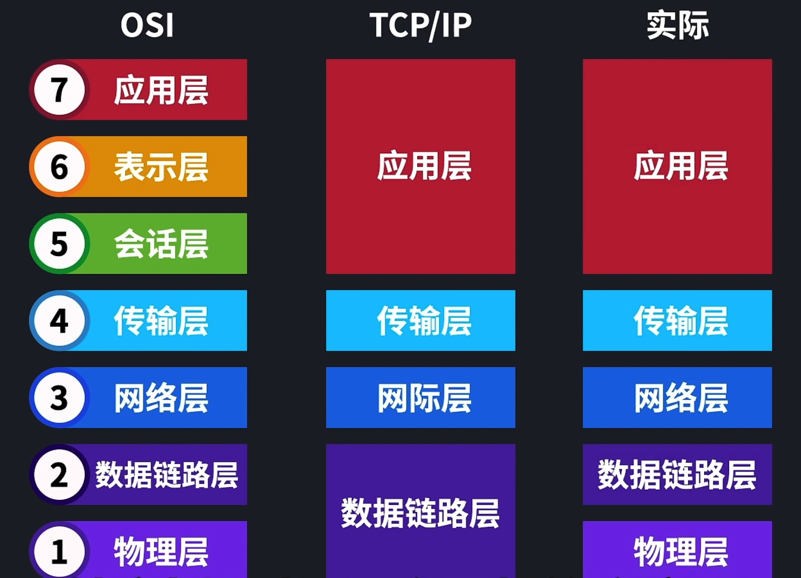
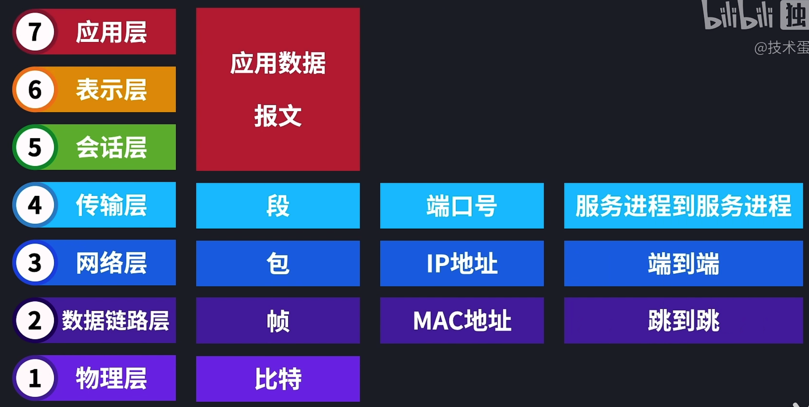
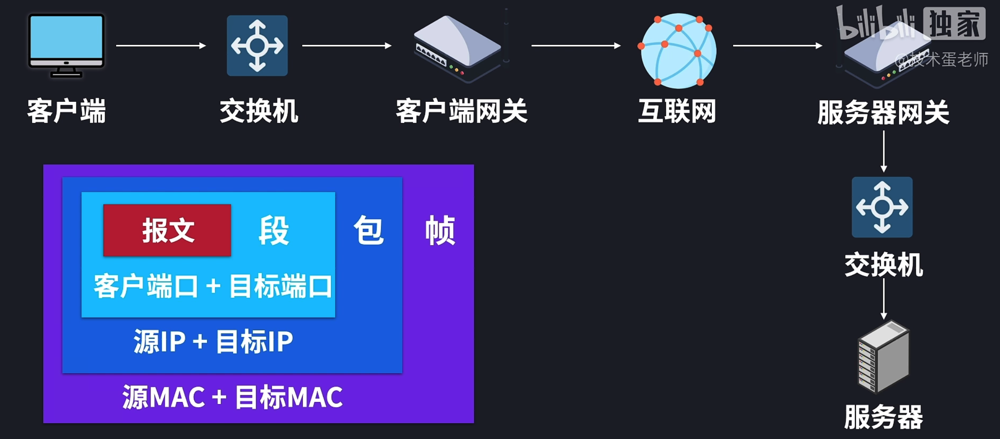
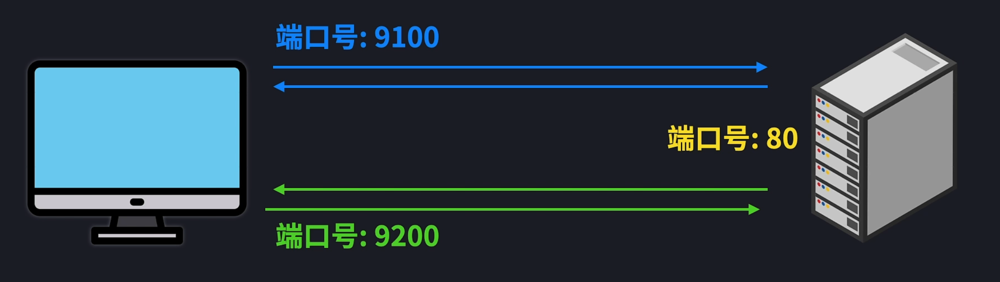
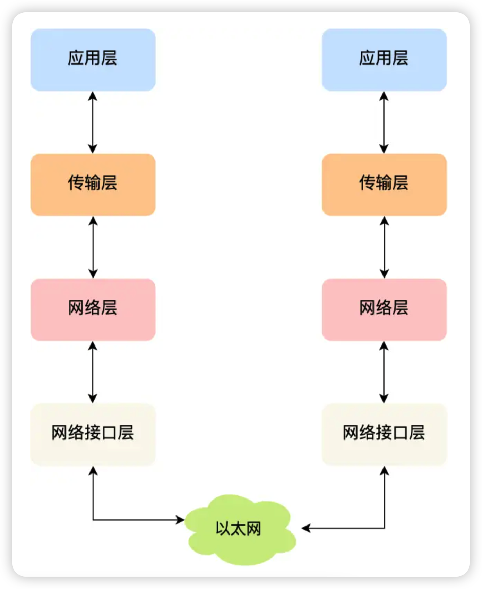
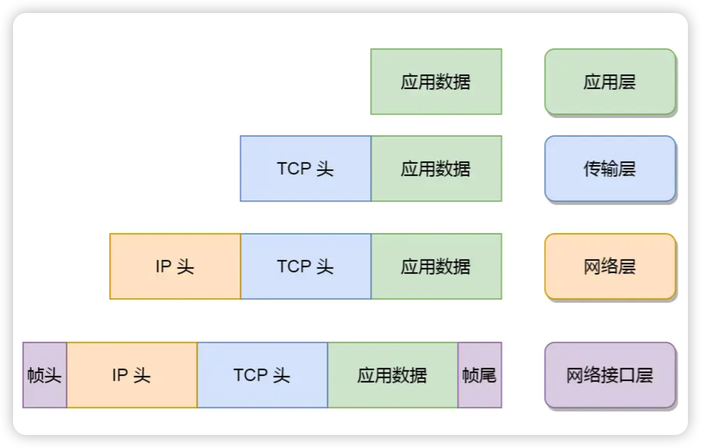

# 入门篇

> 基于TCP/IP四层体系结构, 通过自顶向下的思路, 先后为大家介绍应用层->传输层->网络层->网络接口层的具体内容

## 素材来源

- 小林计算机网络：[图解网络介绍 | 小林coding (xiaolincoding.com)](https://www.xiaolincoding.com/network/)

- 湖科大计算机网络：https://www.bilibili.com/video/BV1c4411d7jb?p=1

- 蛋🥚老师计算机网络：https://www.bilibili.com/video/BV1EU4y1v7ju

##  模型划分

针对OSI七层模型，

- 就对数据名称来说，不同层分别有报文，段，包，帧，比特
- 就地址来说，有端口号，IP逻辑地址和MAC物理地址
- 就传输功能，有服务进程到服务进程，端到端，跳到跳

整体流程：

学习路线：

- 了解计算机网络的基本概念和体系结构，如OSI七层模型、**TCP/IP四层模型**、网络设备和协议等。
- 学习计算机网络的核心协议和技术，如TCP/UDP、IP、ARP、ICMP、DNS、DHCP、HTTP等，并掌握其工作原理和特点。
- 学习计算机网络的常用工具和方法，如ping、traceroute、telnet、ssh、ftp等，并熟悉如何使用它们进行网络测试和调试。
- 学习计算机网络的高级主题和应用，如路由算法、拥塞控制、安全加密、无线网络等，并了解它们在实际场景中的作用和挑战。
- 多做一些计算机网络相关的练习题和模拟面试题，并总结自己的知识点和疑问。

## 应用层(HTTP/DNS/FTP/SMTP)

负责处理应用程序的沟通问题，是最接近用户的一层

但应用层只不过是**逻辑上**把两个应用连通，实际**物理上**的联通是需要物理层的

## 传输层(TCP/UDP)

> 服务于应用层, 将其作为应用之间数据传输的媒介,帮助实现应用到应用的通信

名为传输层, 实际的传输功能交给下一层 - 网络层

传输层（运输层） 在网络层的端到端基础上，实现了服务进程到服务进程的传输

传输层管理两个节点之间数据的传输，负责可靠传输和不可靠传输，主要协议为TCP，UDP以及QUIC（HTTP/3.0）中配置UDP使用

TCP协议允许应用把字节流变成多分段，而不是发送整个字节流

流量控制保证传输速度错误控制进行数据的完整接收

## 网络层(IP/ARP)

> 添加IP头部

### IP地址

网络层负责将数据从一个设备传输到另一个设备，世界上那么多设备，又该如何**找到对方**呢？

因此，网络层需要有区分设备的编号, 我们一般用 **IP 地址给设备进行编号**

IP地址这样的逻辑地址是实现端到端的基础

路由器是网络层的核心，包就是网络层里数据的名字，在封装成帧之前就是包

路由器根据包里的IP地址进行路由转发，地址管理和路由选择就是这一层的核心

### IP协议

IP协议有两大作用: 

- 寻址：告诉我们去往下一个目的地该朝哪个方向走「像是导航」
- 路由：根据“下一个目的的”选择路径「像是操作方向盘」

## 网络接口层

>实现网卡接口的网络驱动程序，以处理数据在物理媒介上的传输

生成了 IP 头部之后，接下来要交给**网络接口层**（*Link Layer*）在 **IP 头部的前面加上 MAC 头部，并封装成数据帧（Data frame）**发送到网络上。

IP 头部中的接收方 IP 地址表示网络包的目的地，通过这个地址我们就可以判断要将包发到哪里，但在以太网的世界中，这个思路是行不通的。

什么是以太网呢？电脑上的以太网接口，Wi-Fi接口，以太网交换机、路由器上的千兆，万兆以太网口，还有网线，它们都是以太网的组成部分。以太网就是一种在「局域网」内，把附近的设备连接起来，使它们之间可以进行通讯的技术。

以太网在判断网络包目的地时和 IP 的方式不同，因此必须采用相匹配的方式才能在以太网中将包发往目的地，而 MAC 头部就是干这个用的，所以，在以太网进行通讯要用到 MAC 地址。

MAC 头部是以太网使用的头部，它包含了接收方和发送方的 MAC 地址等信息，我们可以通过 ARP 协议获取对方的 MAC 地址。

所以说，网络接口层主要为网络层提供「链路级别」传输的服务，负责在以太网、WiFi 这样的底层网络上发送原始数据包，工作在网卡这个层次，使用 MAC 地址来标识网络上的设备。

## 总结

综上所述，TCP/IP 网络通常是由上到下分成 4 层，分别是**应用层，传输层，网络层和网络接口层**。

每一层的封装格式如下啊

## 深入学习

图书推荐:

- 《**图解 HTTP**》
- 《**图解 TCP/IP**》
  - 这本书也是以大量的图文来介绍了 TCP/IP 网络模式的每一层，但是这个书籍的顺序不是从「应用层 —> 物理层」，而是从「物理层 -> 应用层」顺序开始讲的，这一点我觉得不太好，这样一上来就把最枯燥的部分讲了，很容易就被劝退了，所以我建议先跳过前面几个章节，先看网络层和传输层的章节，然后再回头看前面的这几个章节。
- 《**网络是怎样连接的**》
- 《**计算机网络 - 自顶向下方法**》
- 《**TCP/IP 详解 卷一：协议**》

实战演练:

在学习书籍资料的时候，不管是 TCP、UDP、ICMP、DNS、HTTP、HTTPS 等协议，最好都可以亲手尝试抓数据报，接着可以用 [Wireshark 工具 (opens new window)](https://mp.weixin.qq.com/s/bHZ2_hgNQTKFZpWMCfUH9A)看每一个数据报文的信息，这样你会觉得计算机网络没有想象中那么抽象了，因为它们被你「抓」出来了，并毫无保留地显现在你面前了，于是你就可以肆无忌惮地「扒开」它们，看清它们每一个头信息。

## 键入网址到网页显示发生了什么

键入网址到网页显示，期间发生了很多复杂的过程，大致可以分为以下几个步骤：

- 域名解析：浏览器需要将输入的网址（域名）转换为对应的IP地址，才能找到目标服务器。这个过程涉及到本地hosts文件、本地DNS缓存、本地DNS服务器和远程DNS服务器等多个环节。
- TCP连接：浏览器通过域名解析得到IP地址后，需要和服务器建立一个TCP连接，以便进行数据传输。这个过程涉及到三次握手、端口号、套接字等概念。
- HTTP请求：浏览器通过TCP连接向服务器发送一个HTTP请求报文，包含了请求方法、请求头、请求体等信息。这个过程涉及到HTTP协议、URL格式、Cookie等概念。
- HTTP响应：服务器收到浏览器的HTTP请求后，根据请求内容进行处理，并返回一个HTTP响应报文，包含了状态码、响应头、响应体等信息。这个过程涉及到HTTP协议、状态码含义、缓存控制等概念。
- 渲染页面：浏览器收到服务器的HTTP响应后，根据响应体中的HTML代码开始渲染页面，同时可能会发送额外的HTTP请求获取CSS、JS、图片等资源。这个过程涉及到HTML语法、CSS规则、JS脚本、DOM树构建等概念。
- 断开连接：浏览器渲染完页面后，会根据一定的规则和服务器断开TCP连接，以释放资源。这个过程涉及到四次挥手、长连接和短连接等概念。

在小林Coding的图解网络中, 有更加详细的介绍([2.2 键入网址到网页显示，期间发生了什么？ | 小林coding (xiaolincoding.com)](https://www.xiaolincoding.com/network/1_base/what_happen_url.html#孤单小弟-http))

> 以www.server.com为例

- 孤单小弟: 解析URL, 产生HTTP请求报文
- 真实地址查询: 通过本地DNS服务器进行真实地址的查询, 如果解析后的URL存在于本地DNS服务器中则直接获取了真实地址, 若不存在于本地DNS服务器中, 则通过域名的层级关系依次向根DNS服务器->顶级域DNS服务器(.com)->权威DNS服务器(server.com)
- 指南好帮手: 告诉HTTP数据包传输时需要哪些大佬的帮助
- 可靠传输TCP: 通过TCP三次握手建立连接, 保证通信双方都有发送和接收的能力, 添加**TCP头部**
- 远程定位IP: 添加**IP头部**
- 两点传输MAC:添加**MAC头部**
- 出口-网卡:网络包只是存放在内存中的一串二进制数字信息，没有办法直接发送给对方。因此，我们需要将**数字信息转换为电信号**，才能在网线上传输，也就是说，这才是真正的数据发送过程。
- 通过交换机(基于以太网设计, 二层网络设备)与路由器(基于IP设计, 三层网络设备), 数据包最终抵达目的地
- 服务器层层解析, 向客户端返回数据包, 经过相同的过程抵达客户端
- 客户端离开, 服务器TCP四次挥手
