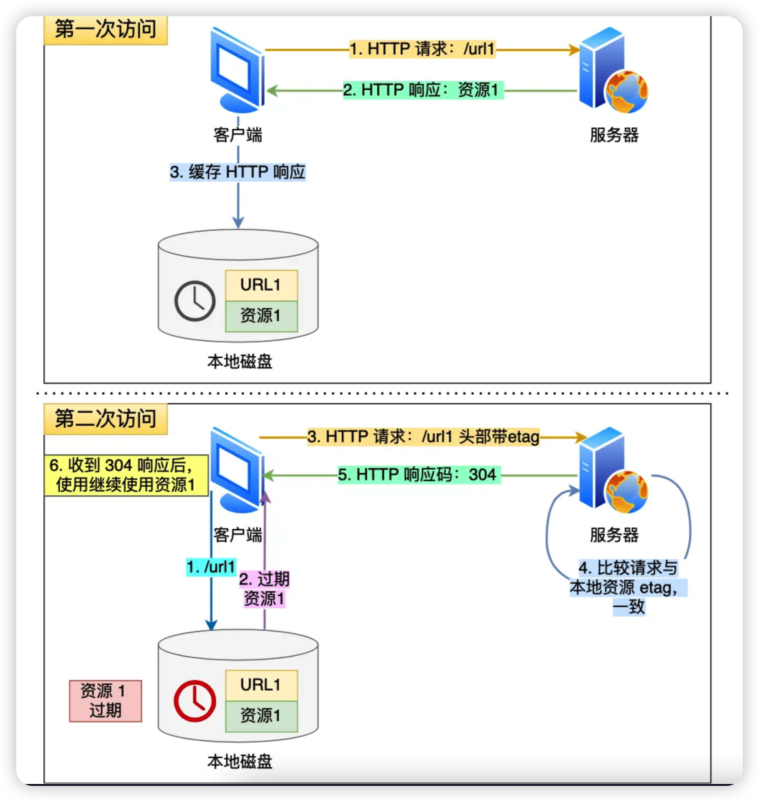
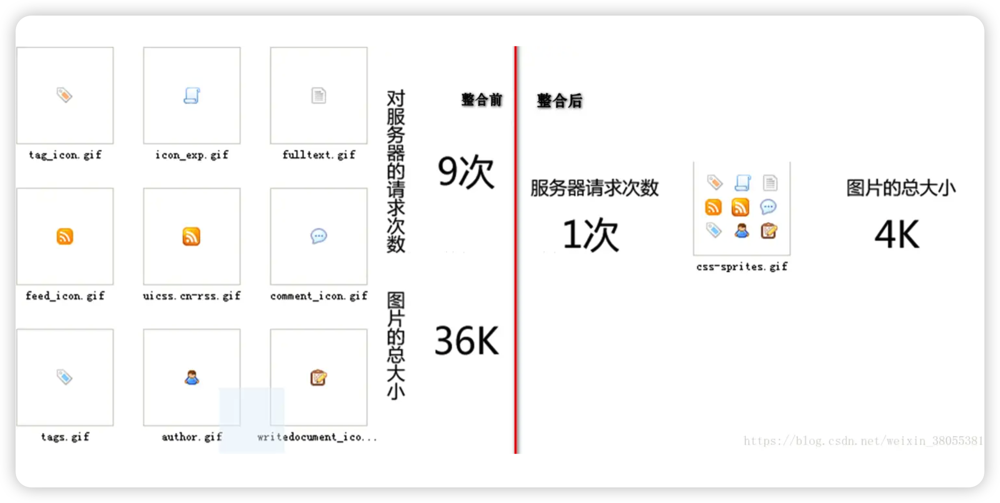
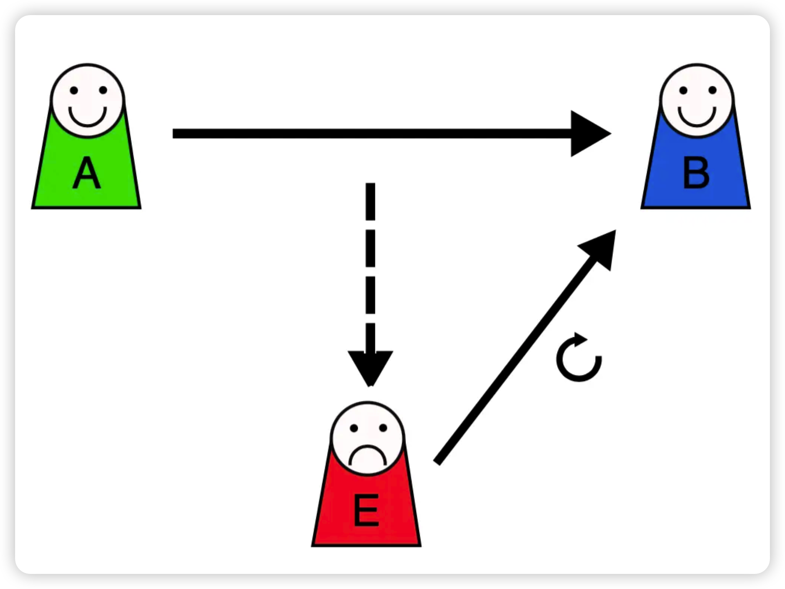

---
tag:
 - 计算机网络
---

# HTTP/1.1如何优化

我们可以从下面这三种优化思路来优化 HTTP/1.1 协议：

- *尽量避免发送 HTTP 请求*；
  - 缓存
- *在需要发送 HTTP 请求时，考虑如何减少请求次数*；
  - 减少重定向请求次数
  - 合并请求
  - 延迟发送请求
- *减少服务器的 HTTP 响应的数据大小*；
  - 无损压缩
  - 有损压缩

## 避免发送HTTP请求

> 强制缓存与协商缓存

- 强制缓存
- 协商缓存
  - 时间标识符「Last-Modified」
  - Etag 「响应唯一标识符」




## 减少HTTP请求次数

### 减少重定向请求次数

**将重定向的工作交由代理服务器完成，进而减少 HTTP 请求次数**

`302`是临时重定向 

`301` 和 `308` 响应码是告诉客户端可以将重定向响应缓存到本地磁盘，之后客户端就自动用 url2 替代 url1 访问服务器的资源。

### 合并请求

如果把多个访问小文件的请求合并成一个大的请求，虽然传输的总资源还是一样，但是减少请求，也就意味着**减少了重复发送的 HTTP 头部**。

另外由于 HTTP/1.1 是请求响应模型，如果第一个发送的请求，未收到对应的响应，那么后续的请求就不会发送（PS：HTTP/1.1 管道模式是默认不使用的，所以讨论 HTTP/1.1 的队头阻塞问题，是不考虑管道模式的），于是为了防止单个请求的阻塞，所以**一般浏览器会同时发起 5-6 个请求，每一个请求都是不同的 TCP 连接**，那么如果合并了请求，也就会**减少 TCP 连接的数量，因而省去了 TCP 握手和慢启动过程耗费的时间**。

有的网页会含有很多小图片、小图标，有多少个小图片，客户端就要发起多少次请求。那么对于这些小图片，我们可以考虑使用 `CSS Image Sprites` 技术把它们合成一个大图片，这样浏览器就可以用一次请求获得一个大图片，然后再根据 CSS 数据把大图片切割成多张小图片。



这种方式就是**通过将多个小图片合并成一个大图片来减少 HTTP 请求的次数，以减少 HTTP 请求的次数，从而减少网络的开销**。

除了将小图片合并成大图片的方式，还有服务端使用 `webpack` 等打包工具将 js、css 等资源合并打包成大文件，也是能达到类似的效果。

另外，还可以将图片的二进制数据用 `base64` 编码后，以 URL 的形式嵌入到 HTML 文件，跟随 HTML 文件一并发送.

```text
<image src="data:image/png;base64,iVBORw0KGgoAAAANSUhEUgAAAPoAAAFKCAIAAAC7M9WrAAAACXBIWXMAA ... />
```

这样客户端收到 HTML 后，就可以直接解码出数据，然后直接显示图片，就不用再发起图片相关的请求，这样便减少了请求的次数。

可以看到，**合并请求的方式就是合并资源，以一个大资源的请求替换多个小资源的请求**。

但是这样的合并请求会带来新的问题，**当大资源中的某一个小资源发生变化后，客户端必须重新下载整个完整的大资源文件**，这显然带来了额外的网络消耗。

### 延迟发送请求

不要一口气吃成大胖子，一般 HTML 里会含有很多 HTTP 的 URL，当前不需要的资源，我们没必要也获取过来，于是可以通过「**按需获取**」的方式，来减少第一时间的 HTTP 请求次数。

请求网页的时候，没必要把全部资源都获取到，而是只获取当前用户所看到的页面资源，当用户向下滑动页面的时候，再向服务器获取接下来的资源，这样就达到了延迟发送请求的效果。

## 如何减少 HTTP 响应的数据大小？

通常 HTTP 的响应的数据大小会比较大，也就是服务器返回的资源会比较大。

于是，我们可以考虑对响应的资源进行**压缩**，这样就可以减少响应的数据大小，从而提高网络传输的效率。

压缩的方式一般分为 2 种，分别是：

- *无损压缩*
- *有损压缩*

### 无损压缩

无损压缩是指资源经过压缩后，信息不被破坏，还能完全恢复到压缩前的原样，适合用在文本文件、程序可执行文件、程序源代码。

首先，我们针对代码的语法规则进行压缩，因为通常代码文件都有很多换行符或者空格，这些是为了帮助程序员更好的阅读，但是机器执行时并不要这些符，把这些多余的符号给去除掉。

接下来，就是无损压缩了，需要对原始资源建立统计模型，利用这个统计模型，将常出现的数据用较短的二进制比特序列表示，将不常出现的数据用较长的二进制比特序列表示，生成二进制比特序列一般是「霍夫曼编码」算法。

gzip 就是比较常见的无损压缩。客户端支持的压缩算法，会在 HTTP 请求中通过头部中的 `Accept-Encoding` 字段告诉服务器：

```text
Accept-Encoding: gzip, deflate, br
```

服务器收到后，会从中选择一个服务器支持的或者合适的压缩算法，然后使用此压缩算法对响应资源进行压缩，最后通过响应头部中的 `Content-Encoding` 字段告诉客户端该资源使用的压缩算法。

```text
Content-Encoding: gzip
```

gzip 的压缩效率相比 Google 推出的 Brotli 算法还是差点意思，也就是上文中的 br，所以如果可以，服务器应该选择压缩效率更高的 br 压缩算法。

### 有损压缩

与无损压缩相对的就是有损压缩，经过此方法压缩，解压的数据会与原始数据不同但是非常接近。

有损压缩主要将次要的数据舍弃，牺牲一些质量来减少数据量、提高压缩比，这种方法经常用于压缩多媒体数据，比如音频、视频、图片。

可以通过 HTTP 请求头部中的 `Accept` 字段里的「 q 质量因子」，告诉服务器期望的资源质量。

```text
Accept: audio/*; q=0.2, audio/basic
```

关于图片的压缩，目前压缩比较高的是 Google 推出的 **WebP 格式**

## 总结

这次主要从 3 个方面介绍了优化 HTTP/1.1 协议的思路。

第一个思路是，通过缓存技术来避免发送 HTTP 请求。客户端收到第一个请求的响应后，可以将其缓存在本地磁盘，下次请求的时候，如果缓存没过期，就直接读取本地缓存的响应数据。如果缓存过期，客户端发送请求的时候带上响应数据的摘要，服务器比对后发现资源没有变化，就发出不带包体的 304 响应，告诉客户端缓存的响应仍然有效。

第二个思路是，减少 HTTP 请求的次数，有以下的方法：

1. 将原本由客户端处理的重定向请求，交给代理服务器处理，这样可以减少重定向请求的次数；
2. 将多个小资源合并成一个大资源再传输，能够减少 HTTP 请求次数以及 头部的重复传输，再来减少 TCP 连接数量，进而省去 TCP 握手和慢启动的网络消耗；
3. 按需访问资源，只访问当前用户看得到/用得到的资源，当客户往下滑动，再访问接下来的资源，以此达到延迟请求，也就减少了同一时间的 HTTP 请求次数。

第三思路是，通过压缩响应资源，降低传输资源的大小，从而提高传输效率，所以应当选择更优秀的压缩算法。

# HTTPS 如何优化？

- 性能损耗

- 硬件优化

- 软件优化

- 协议优化

- 证书优化

- 会话复用

  - Session ID

  - Session Ticket - 类似HTTP的Cookie

    - 为了解决 Session ID 的问题，就出现了 Session Ticket，**服务器不再缓存每个客户端的会话密钥，而是把缓存的工作交给了客户端**，类似于 HTTP 的 Cookie。

      客户端与服务器首次建立连接时，服务器会加密「会话密钥」作为 Ticket 发给客户端，交给客户端缓存该 Ticket。

      客户端再次连接服务器时，客户端会发送 Ticket，服务器解密后就可以获取上一次的会话密钥，然后验证有效期，如果没问题，就可以恢复会话了，开始加密通信。

    - 重放攻击

      - 

      - 假设 Alice 想向 Bob 证明自己的身份。 Bob 要求 Alice 的密码作为身份证明，爱丽丝应尽全力提供（可能是在经过如哈希函数的转换之后）。与此同时，Eve 窃听了对话并保留了密码（或哈希）。

        交换结束后，Eve（冒充 Alice ）连接到 Bob。当被要求提供身份证明时，Eve 发送从 Bob 接受的最后一个会话中读取的 Alice 的密码（或哈希），从而授予 Eve 访问权限。

        重放攻击的危险之处在于，如果中间人截获了某个客户端的 Session ID 或 Session Ticket 以及 POST 报文，而一般 POST 请求会改变数据库的数据，中间人就可以利用此截获的报文，不断向服务器发送该报文，这样就会导致数据库的数据被中间人改变了，而客户是不知情的。

        避免重放攻击的方式就是需要**对会话密钥设定一个合理的过期时间**。

## 总结

对于硬件优化的方向，因为 HTTPS 是属于计算密集型，应该选择计算力更强的 CPU，而且最好选择**支持 AES-NI 特性的 CPU**，这个特性可以在硬件级别优化 AES 对称加密算法，加快应用数据的加解密。

对于软件优化的方向，如果可以，把软件升级成较新的版本，比如将 Linux 内核 2.X 升级成 4.X，将 openssl 1.0.1 升级到 1.1.1，因为新版本的软件不仅会提供新的特性，而且还会修复老版本的问题。

对于协议优化的方向：

- 密钥交换算法应该选择 **ECDHE 算法**，而不用 RSA 算法，因为 ECDHE 算法具备前向安全性，而且客户端可以在第三次握手之后，就发送加密应用数据，节省了 1 RTT。
- 将 TLS1.2 升级 **TLS1.3**，因为 TLS1.3 的握手过程只需要 1 RTT，而且安全性更强。

对于证书优化的方向：

- 服务器应该选用 **ECDSA 证书**，而非 RSA 证书，因为在相同安全级别下，ECC 的密钥长度比 RSA 短很多，这样可以提高证书传输的效率；
- 服务器应该开启 **OCSP Stapling** 功能，由服务器预先获得 OCSP 的响应，并把响应结果缓存起来，这样 TLS 握手的时候就不用再访问 CA 服务器，减少了网络通信的开销，提高了证书验证的效率；

对于重连 HTTPS 时，我们可以使用一些技术让客户端和服务端使用上一次 HTTPS 连接使用的会话密钥，直接恢复会话，而不用再重新走完整的 TLS 握手过程。

常见的**会话重用**技术有 Session ID 和 Session Ticket，用了会话重用技术，当再次重连 HTTPS 时，只需要 1 RTT 就可以恢复会话。对于 TLS1.3 使用 Pre-shared Key 会话重用技术，只需要 0 RTT 就可以恢复会话。

这些会话重用技术虽然好用，但是存在一定的安全风险，它们不仅不具备前向安全，而且有重放攻击的风险，所以应当对会话密钥设定一个合理的过期时间。
