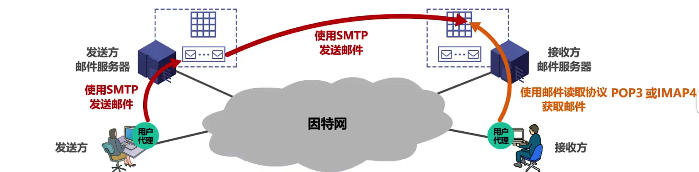
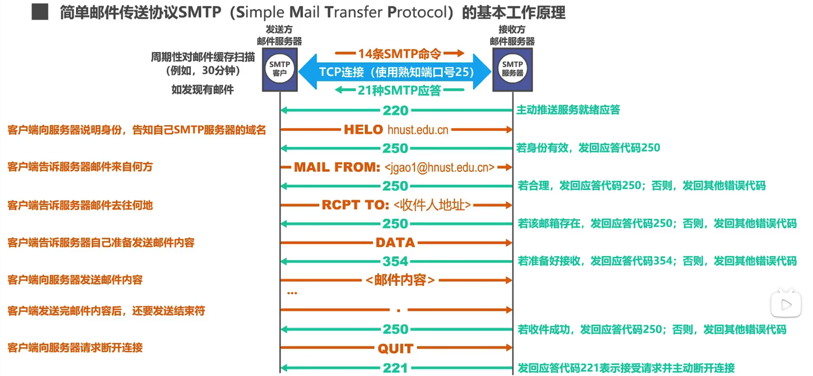
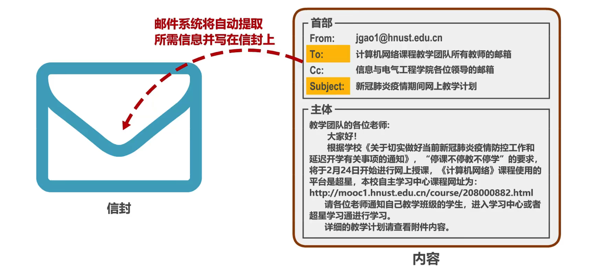
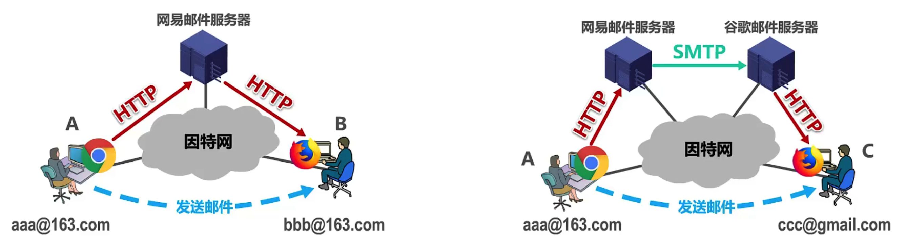
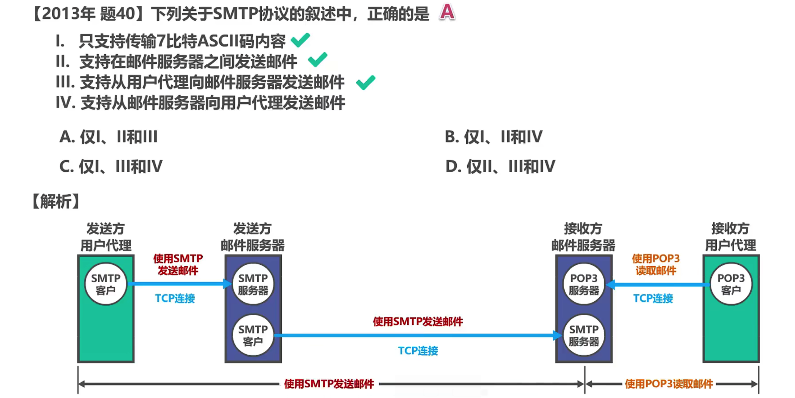
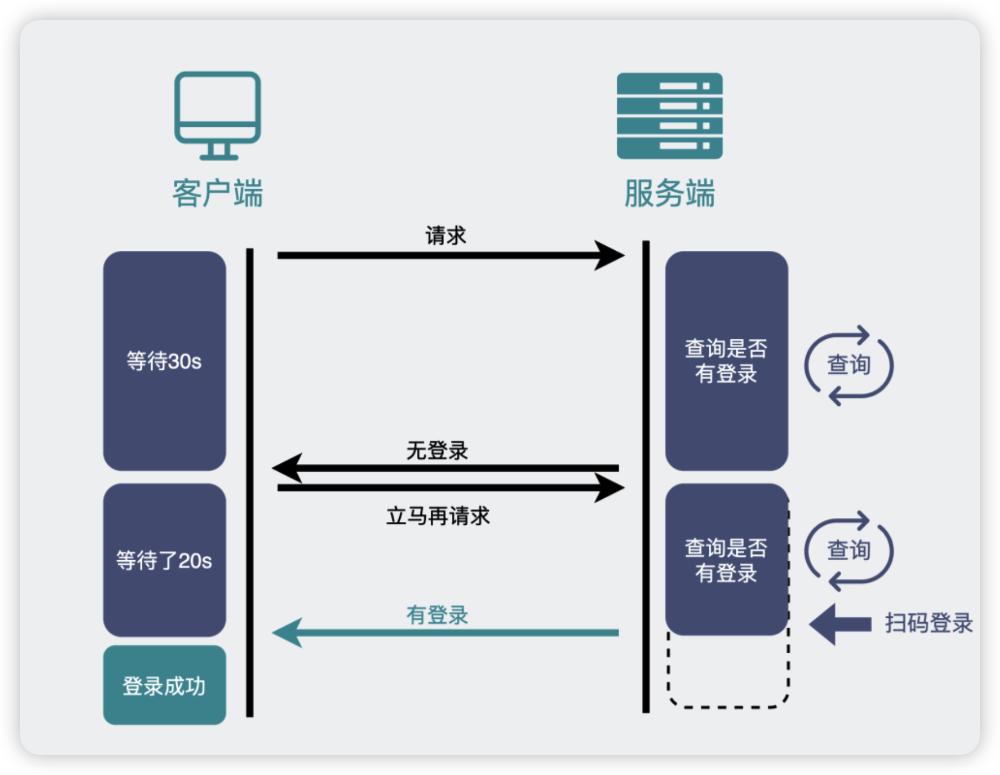

---
tag:
 - 计算机网络
---

# 应用层-协议种类

**应用层有许多协议，包括**

1. **域名系统DNS协议**
2. **FTP文件传输协议**
3. Telnet远程终端协议
4. Telnet远程登录协议
5. **SMTP电子邮件协议**
6. **POP3邮件读取协议**
7. SNMP简单网络管理协议等
8. **HTTP超文本传输协议**

> 应用层协议 (application layer protocol)定义了运行在不同端系统上的应用程序进程
>
> 相互传递报文的方式

## DNS

## FTP

## SMTP与POP3

### 邮件的发送与读取流程

电子邮件系统采用客户/服务器（C/S）方式。
电子邮件系统的三个主要组成构件：用户代理，邮件服务器，以及电子邮件所需的协议。

- 用户代理是用户与电子邮件系统的接口，又称为**电子邮件客户端软件**。

- 邮件服务器是电子邮件系统的基础设施。因特网上所有的ISP都有邮件服务器，其功能是发送和接收邮件，同时还要负责维护用户的邮箱。
- 协议包括邮件发送协议（例如SMTP）和邮件读取协议（例如POP3, IMAP)

邮件的发送要经历两个流程

- 用户代理到发送方邮件服务器
- 发送方邮件服务器到接受方邮件服务器

邮件的接收要经历一个流程

- 接收方邮件服务器到接受方用户代理

### SMTP原理

注意：

1.  为了简单起见，省略了认证过程；

2. 应答代码后面一般都跟有简单的描述信息
3. 不同的SMTP服务器给出的相同应答代码
  的描述信息可能不同

### 邮件格式

电子邮件的信息格式并不是由SMTP定义的，而是在RFC 822中单独定义的。这个RFC文档己在2008年更新为RFC 5322。一个电子邮件有信封和内容两部分。而内容又由首部和主体两部分构成。

  

### SMTP的缺陷与MIME的产生

- SMTP协议只能传送ASCI码文本数据，不能传送可执行文件或其他的二进制对象。

- SMTP协议只能传送7位(7比特)的ASCII码

- SMTP不能满足传送多媒体邮件（例如带有图片、音频或视频数据）的需要。并且许多其他非英语国家的文字 
  (例如中文、俄文、甚至带有重音符号的法文或德文）也无法用SMTP传送。

- 为解决SMTP传送非ASCII码文本的问题，提出了多用途因特网邮件扩展MIME (Multipurpose Internet Mail Extensions)

  - 增加了5个新的邮件首部字段，这些字段提供了有关邮件主体的信息。

  - 定义了许多邮件内容的格式，对多媒体电子邮件的表示方法进行了标淮化。
    口 

  - 定义了传送编码，可对任何内容格式进行转换，而不会被邮件系统改变。

  - > 实际上，MIME不仅仅用于SMTP，也用于后来的同样面向ASCl字符的HTTP。

### 邮件的读取

常用的邮件读取协议有以下两个：

- 邮局协议POP (Post Office Protocol)，POP3是其第三个版本，是因特网正式标准。
  非常简单、功能有限的邮件读取协议。用户只能以下载并删除方式或下载并保留方式从邮件服务器下载邮件到用户方计算机。不允许用户在邮件服务器上管理自己的邮件。（例如创建文件夹，对邮件进行分类管理等)。
- 因特网邮件访问协议IMAP (Internet Message Access Protocol)，IMAP4是其第四个版本，目前还只是因特网建议标准。功能比POP3强大的邮件读取协议。用户在自己的计算机上就可以操控邮件服务器中的邮箱，就像在本地操控一样，因此IMAP是一个联机协议。
- POP3和IMAP4都采用基于TCP连接的客户/服务器方式。POP3使用熟知端口110，IMAP4使用熟 知端口143。

### 基于HTTP的邮件发送

- 通过浏览器登录（提供用户名和口令）邮件服务器万维网网站就可以撰写、收发、阅读和管理电子邮件。

- 这种工作模式与IMAP很类似，不同的是用户计算机无需安装专门的用户代理程序，只需要
  使用通用的万维网浏览器。

- 邮件服务器网站通常都提供非常强大和方便的邮件管理功能，用户可以在邮件服务器网站上管理和处理自己的邮件，而不需要将邮件下载到本地进行管理。

  

### 习题

 

## WebSocket的产生

### HTTP 不断轮询

问题的痛点在于，**怎么样才能在用户不做任何操作的情况下，网页能收到消息并发生变更。**

最常见的解决方案是，**网页的前端代码里不断定时发 HTTP 请求到服务器，服务器收到请求后给客户端响应消息。**

这其实时一种「**伪**」服务器推的形式。

它其实并不是服务器主动发消息到客户端，而是客户端自己不断偷偷请求服务器，只是用户无感知而已。

以「扫码登录」的场景为例:

某信公众号平台，登录页面二维码出现之后，**前端**网页根本不知道用户扫没扫，于是不断去向**后端**服务器询问，看有没有人扫过这个码。而且是以大概 1 到 2 秒的间隔去不断发出请求，这样可以保证用户在扫码后能在 1 到 2 秒内得到及时的反馈，不至于**等太久**。

使用HTTP定时轮询

但这样，会有两个比较明显的问题：

- 当你打开 F12 页面时，你会发现满屏的 HTTP 请求。虽然很小，但这其实也消耗带宽，同时也会增加下游服务器的负担。
- 最坏情况下，用户在扫码后，需要等个 1~2 秒，正好才触发下一次 HTTP 请求，然后才跳转页面，用户会感到**明显的卡顿**。

使用起来的体验就是，二维码出现后，手机扫一扫，然后在手机上点个确认，这时候**卡顿等个 1~2 秒**，页面才跳转。

> 使用长轮询可以解决这个问题

### HTTP 长轮询

我们知道，HTTP 请求发出后，一般会给服务器留一定的时间做响应，比如 3 秒，规定时间内没返回，就认为是超时。

如果我们的 HTTP 请求**将超时设置的很大**，比如 30 秒，**在这 30 秒内只要服务器收到了扫码请求，就立马返回给客户端网页。如果超时，那就立马发起下一次请求。**

这样就减少了 HTTP 请求的个数，并且由于大部分情况下，用户都会在某个 30 秒的区间内做扫码操作，所以响应也是及时的。

比如，某度云网盘就是这么干的。所以你会发现一扫码，手机上点个确认，电脑端网页就**秒跳转**，体验很好。

> 像这种发起一个请求，在较长时间内等待服务器响应的机制，就是所谓的**长训轮机制**。我们常用的消息队列 RocketMQ 中，消费者去取数据时，也用到了这种方式。

**复杂场景下:**

上面提到的两种解决方案（不断轮询和长轮询），本质上，其实还是客户端主动去取数据。

对于像扫码登录这样的**简单场景**还能用用。但如果是网页游戏呢，游戏一般会有大量的数据需要从服务器主动推送到客户端。

这就得说下 **WebSocket** 了。

### WebSocket是什么

> WebSocket是应用层协议, 是为了解决HTTP/1.1半双工的缺陷

我们知道 TCP 连接的两端，**同一时间里**，**双方**都可以**主动**向对方发送数据。这就是所谓的**全双工**。

而现在使用最广泛的`HTTP/1.1`，也是基于TCP协议的，**同一时间里**，客户端和服务器**只能有一方主动**发数据，这就是所谓的**半双工**。

也就是说，好好的全双工 TCP，被 HTTP/1.1 用成了半双工。

这是由于 HTTP 协议设计之初，考虑的是看看网页文本的场景，能做到**客户端发起请求再由服务器响应**，就够了，根本就没考虑网页游戏这种，客户端和服务器之间都要互相主动发大量数据的场景。

所以，为了更好的支持这样的场景，我们需要另外一个**基于TCP的新协议**。

于是新的应用层协议**WebSocket**就被设计出来了。注意:socket和Web Socket毫无关系

### HTTP和WebSocket的关系

WebSocket和HTTP一样都是基于TCP的协议。**经历了三次TCP握手之后，利用 HTTP 协议升级为 WebSocket 协议**。

你在网上可能会看到一种说法："WebSocket 是基于HTTP的新协议"，**其实这并不对**，因为WebSocket只有在建立连接时才用到了HTTP，**升级完成之后就跟HTTP没有任何关系了**。

### WebSocket消息格式

WebSocket的数据格式也是**数据头（内含payload长度） + payload data** 的形式。

这是因为 TCP 协议本身就是全双工，但直接使用**纯裸TCP**去传输数据，会有**粘包**的"问题"。为了解决这个问题，上层协议一般会用**消息头+消息体**的格式去重新包装要发的数据。

而**消息头**里一般含有**消息体的长度**，通过这个长度可以去截取真正的消息体。

HTTP 协议和大部分 RPC 协议，以及我们今天介绍的WebSocket协议，都是这样设计的。

### WebSocket的使用场景

WebSocket完美继承了 TCP 协议的**全双工**能力，并且还贴心的提供了解决粘包的方案。

它适用于**需要服务器和客户端（浏览器）频繁交互**的大部分场景，比如网页/小程序游戏，网页聊天室，以及一些类似飞书这样的网页协同办公软件。

回到文章开头的问题，在使用 WebSocket 协议的网页游戏里，怪物移动以及攻击玩家的行为是**服务器逻辑**产生的，对玩家产生的伤害等数据，都需要由**服务器主动发送给客户端**，客户端获得数据后展示对应的效果。

### 总结

- TCP 协议本身是**全双工**的，但我们最常用的 HTTP/1.1，虽然是基于 TCP 的协议，但它是**半双工**的，对于大部分需要**服务器主动推送数据到客户端**的场景，都不太友好，因此我们需要使用**支持全双工**的 WebSocket 协议。
- 在 HTTP/1.1 里，只要客户端不问，服务端就不答。基于这样的特点，对于登录页面这样的简单场景，可以使用**定时轮询或者长轮询**的方式实现**服务器推送**(comet)的效果。
- 对于客户端和服务端之间需要频繁交互的复杂场景，比如网页游戏，都可以考虑使用 WebSocket 协议。
- WebSocket 和 socket 几乎没有任何关系，只是叫法相似。
- 正因为各个浏览器都支持 HTTP协 议，所以 WebSocket 会先利用HTTP协议加上一些特殊的 header 头进行握手升级操作，升级成功后就跟 HTTP 没有任何关系了，之后就用 WebSocket 的数据格式进行收发数据。

## HTTP

> 详见后文...
