---
tag:
 - 计算机网络
---

# TCP与UDP

## TCP和UDP的区别

TCP(**传输控制协议**)和UDP(**用户数据报协议**)是两种不同的传输层协议, 属于TCP/IP体系分层下的第二层, 是直接服务于应用层的协议

> 面向连接, 可靠传输, 面向字节流是TCP的三大特点

### 无连接和面向连接

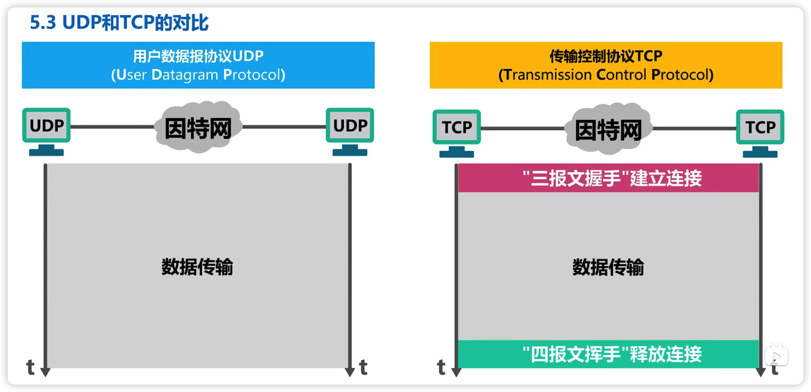

### 不可靠传输与可靠传输

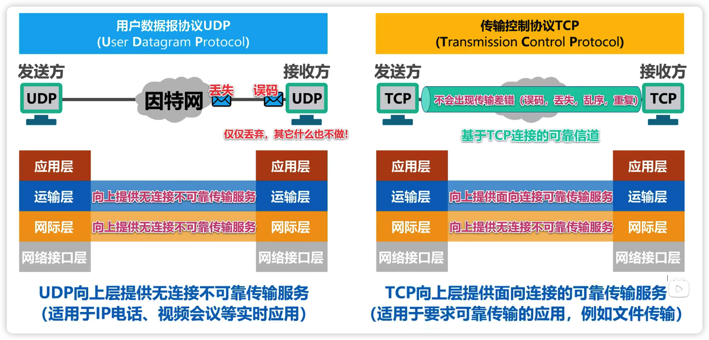

### 面向应用报文和面向字节流

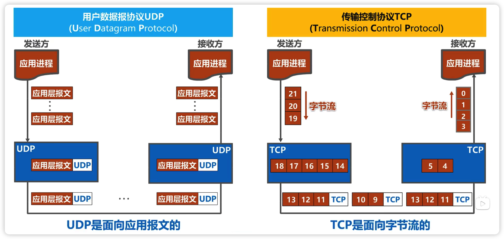

### 单播,多播与广播

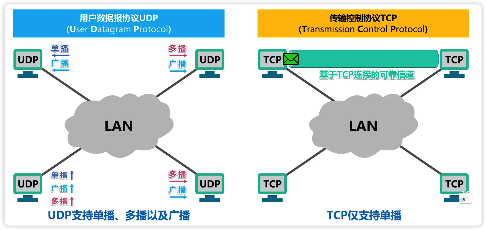

### 协议首部

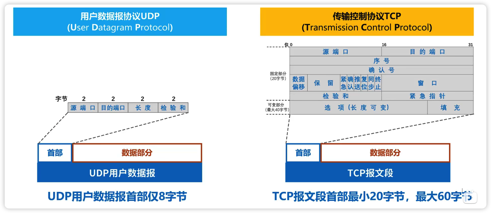

### 总结🔥

1. TCP是**面向连接**的，即在发送数据之前需要先建立连接；UDP是无连接的，即发送数据之前不需要建立连接。
2. TCP提供**可靠传输**，即通过TCP传输的数据不会**丢失、乱序或重复**；UDP无法保证可靠传输，可能出现**丢包、乱序或重复**的情况。
3. TCP**面向字节流**，即将数据看作一个连续的字节序列；UDP**面向应用报文**，即将数据看作一个个独立的报文。
4. TCP有**较长的首部**（20字节），增加了传输开销；UDP有较短的首部（8字节），减少了传输开销。
5. TCP**有流量控制和拥塞控制机制**，可以根据网络状况和接收方能力调整发送速率；UDP没有这些机制，发送方可以**以任意速率发送数据**。

> 记忆表格如下:

| 特征     | TCP                                                          | UDP                                                         |
| -------- | :----------------------------------------------------------- | ----------------------------------------------------------- |
| 连接性   | 面向连接，需要先建立连接再发送数据¹²³                        | 无连接，不需要建立连接就可以发送数据¹²³                     |
| 可靠性   | 可靠，不会出现数据丢失、乱序或重复¹²³                        | 不可靠，可能出现数据丢包、乱序或重复¹²³                     |
| 数据单位 | 面向字节流，将数据看作一个连续的字节序列¹²³                  | 面向报文，将数据看作一个个独立的报文¹²³                     |
| 控制机制 | 有流量控制和拥塞控制机制，可以根据网络状况和接收方能力调整发送速率¹²³ | 没有流量控制和拥塞控制机制，发送方可以以任意速率发送数据¹²³ |
| 首部长度 | 较长（20字节），增加了传输开销¹²³                            | 较短（8字节），减少了传输开销¹²³                            |

### 应用场景

TCP和UDP的应用场景取决于数据传输的需求。

一般来说，TCP适合那些需要**可靠、有序、完整**的数据传输的应用，例如**网页浏览、文件传输、电子邮件、远程登录**等¹²³。UDP适合那些需要**快速、实时、低延迟**的数据传输的应用，例如**视频会议、语音通话、在线游戏**等¹²³。当然，这些应用场景并不是绝对的，有些应用可能会同时使用TCP和UDP，或者使用其他的协议。

## UDP用户数据报协议

- UDP是一种无连接, 不可靠的**传输层**协议
- 支持快速, 无延迟的通信
- 不保证数据的安全性和完整性
  - 发件人和收件人之间缺乏相互身份验证, 这确保了UDP的**出色传输速度**, 但UDP协议**不能保证数据包的完整性和安全性**
- 没有TCP的拥塞控制和三次握手的机制来保证可靠传输

实时应用程序主要使用基于UDP的实时传输协议（RTP），与基本协议不同，它可以检测数据包丢失

UDP是**传输层协议**，是面向用户数据包协议，不保证可靠交付，**没用TCP的拥塞控制和三次握手的机制**保证可靠传传输，UDP**尽最大努力交付**。最少只有8个字节。UDP支持单播、组播、广播，UDP相对TCP更简单，传输的速率更快，所以通常可以用在实时性比较强的需求上，比如视频会议等。我们可以通过一些操作区增强UDP的可靠传输，腾讯的UDP+TCP机制，最简单的方式是通过 setsockopt来减小缓冲区的大小

UDP有以下特点：

- 简单，轻量化
- 面向报文，保留报文边界
- 尽最大努力交付，不保证可靠性
- 没有拥塞控制，适合实时应用
- 支持一对一、一对多、多对一和多对多的交互通信

## TCP流量控制

我们希望数据传输的快一些

但如果数据发送过快, 接收方来不及接收, 就会造成数据丢失

流量控制: 让发送方的发送速率不要太快, 要让接收方来得及接受

利用滑动窗口机制可以很方便的在TCP连接上实现对发送方的流量控制

- TCP接收方利用自己的**接收窗口**大小来限制发送方**发送窗口**的大小
- TCP发送方收到接受方的**零窗口通知**后, 启动**持续计时器**; 持续计时器超时后, 向接受方发送**零窗口探测报文**

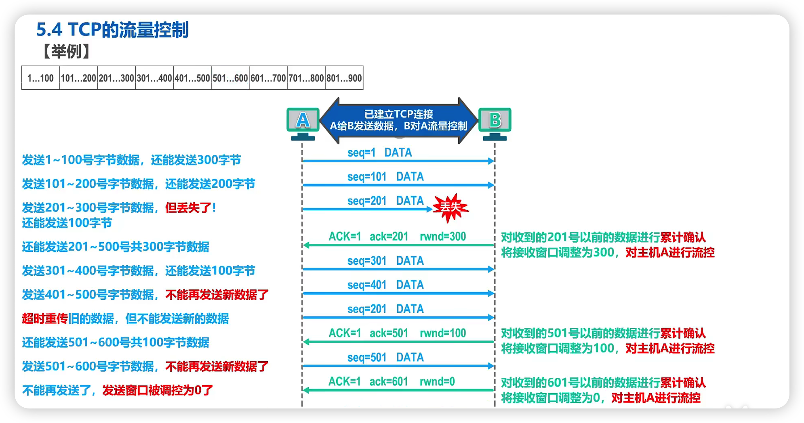

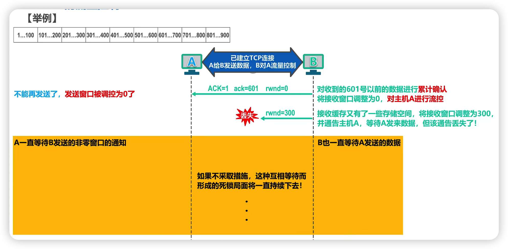

这种情况要用到零窗口探测报文

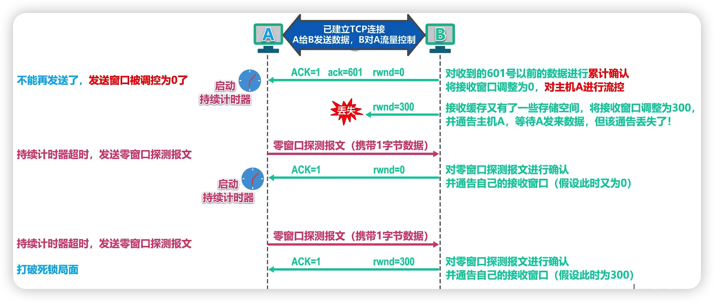

> 零窗口探测报文也有重传计时器, 即使零窗口探测报文发送失效, 当重传计时器超时后, 重传计时器会被重传

例题:

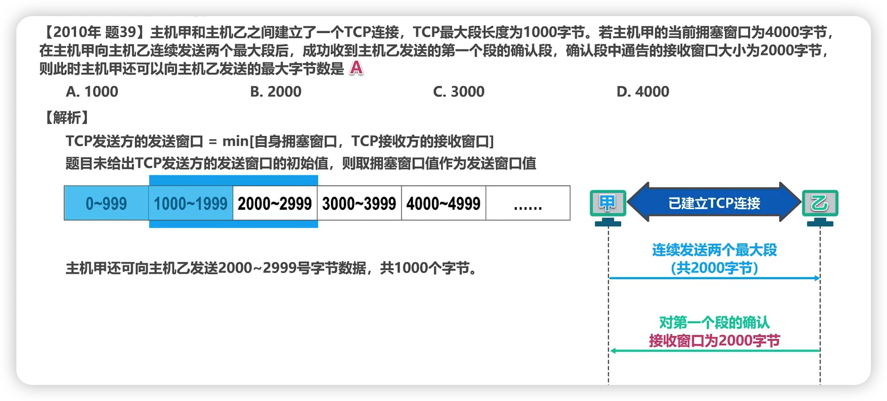

## TCP拥塞控制

> 视频链接🔥: [5.5 TCP的拥塞控制_哔哩哔哩_bilibili](https://www.bilibili.com/video/BV1c4411d7jb/?p=61&spm_id_from=333.880.my_history.page.click&vd_source=d6271710c0aa78f4d90fc3f7028b8301)

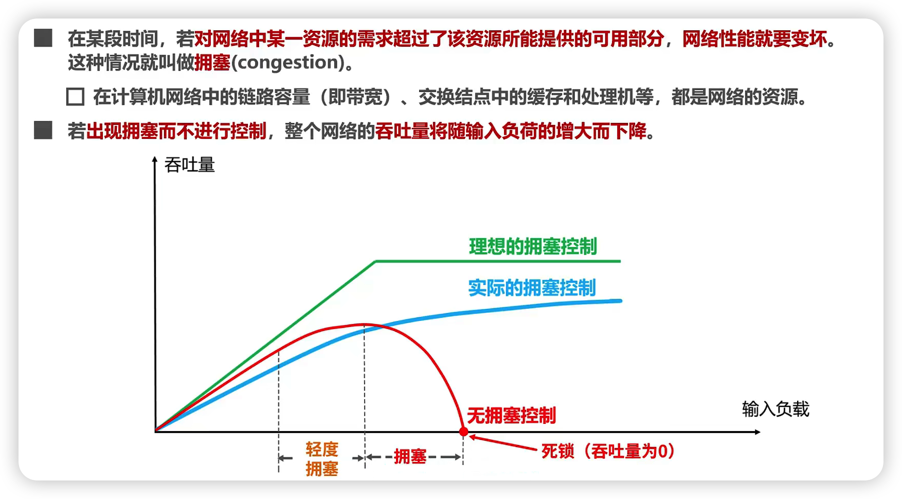

TCP有四种拥塞控制算法, 分别是:

- 慢开始
- 拥塞避免
- 快重传
- 快恢复

下面介绍它们的基本原理, 假定如下条件:

- 数据总是单向传送,另一个方向只传送确认
- 接受方总是有足够大的存储空间, 因而发送方发送窗口的大小由网络的拥塞程度来决定
- 以TCP最大报文段MSS的个数为讨论问题的单位, 而不是以字节为单位

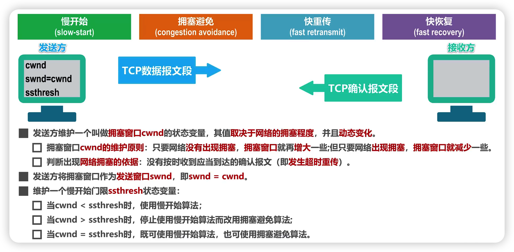

### 慢开始和拥塞避免

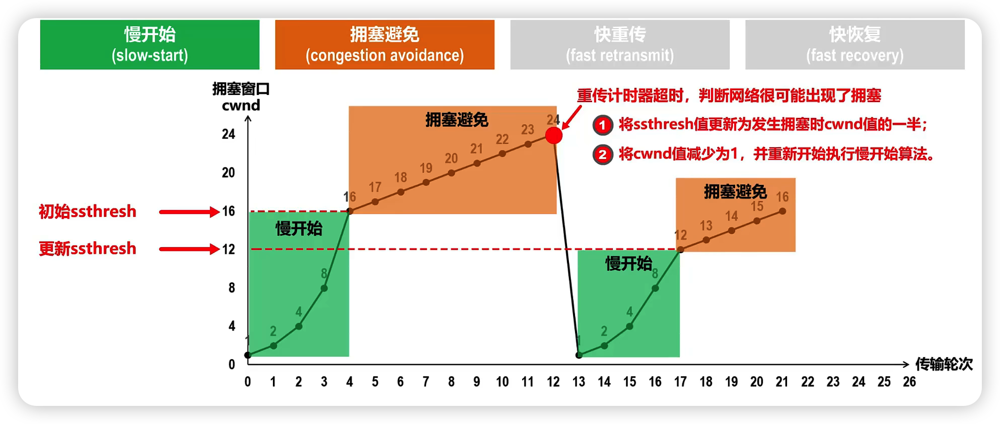

> Note: 
>
> - "慢开始"是指一开始想网络注入的报文段少, 并不是指拥塞窗口cwnd增长速度慢
> - "拥塞避免"并非指能够完全避免拥塞, 而是指在拥塞避免阶段将拥塞窗口控制为按照现行规律增长, 使得网络比较不容易拥塞

### 快重传和快恢复

- 慢开始和拥塞避免算法是1988年提出的TCP拥塞控制算法 (TCP Tahoe版本)
- 1990年又增加了两个新的拥塞控制算法改进TCP性能, 这就是快重传和快恢复 (TCP Reno版本)
  - 有时, **个别报文段**会在网络中丢失,但实际上网络**并未发生拥塞**
    - 这将导致**发送方**超时重传, 并**误认为**网络发生了**拥塞**
    - 于是, 发送方把**拥塞窗口**cwnd又**设置为1**, 并**错误的启动慢开始算法**, 降低了传输效率
    - 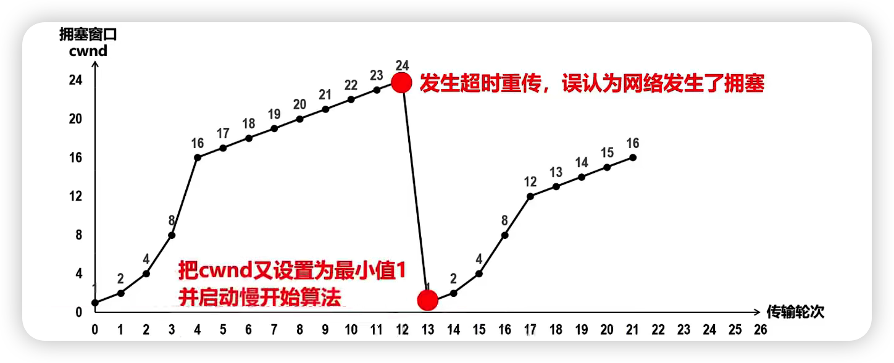
- 采用快重传算法可以让发送方**尽早**知道**发生了个别报文段的丢失**
- 所谓快重传, 就是使得发送方**尽快进行重传**, 而不是**等超时重传计时器超时**再重传
  - 要求接受方不要等待自己发送数据时才进行**稍待确认**, 而是要**立即发送确认**
  - 即使收到了**失序的报文段**也要立即发出对已收到的报文段的**重复确认**
  - 发送方一旦收到**三个连续的重复确认**, 就将相应报文段**立即重传**, 而不是**等超时重传计时器超时**再重传
  - 对于**个别丢失的报文段**, 发送方不会出现超时重传, 也就不会误认为出现了拥塞 (进而降低拥塞窗口cwnd为1), 使用快重传算法可以使得整个网络的吞吐量提高约20%
  - 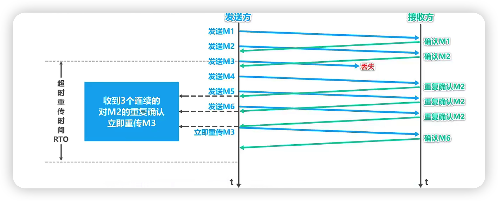
- 发送方一旦收到3个重复确认, 就知道现在只是丢失了个别的报文段, 于是不启动慢开始算法, 而是执行快恢复算法
  - 发送方将慢开始门限ssthresh值调整为初始慢开始门限的一半, 更新拥塞窗口cwnd的值为当前慢开始门限的值, 开始执行拥塞避免算法
  - 也有的是把快恢复开始时的cwnd值增大为ssthresh+3
    - 3个报文段已经停留在接收方的数据缓存中
    - 可见现在网络中减少了3个报文段, 因此可以适当把拥塞窗口扩大一些

### 总结

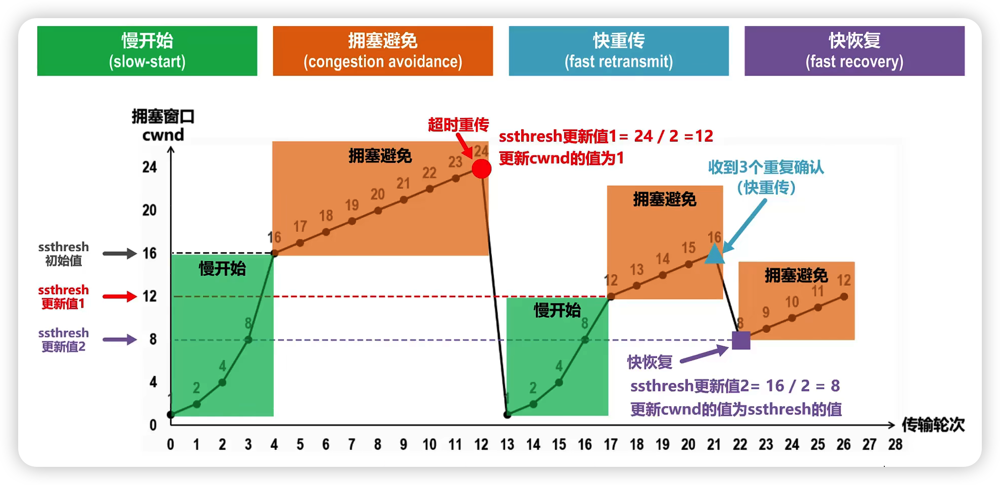

> 例题

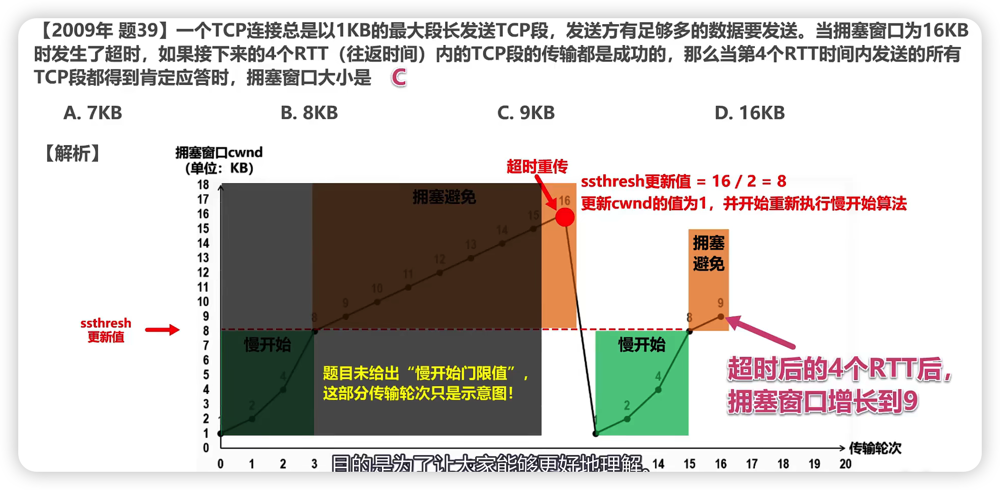

## TCP超时重传时间的选择

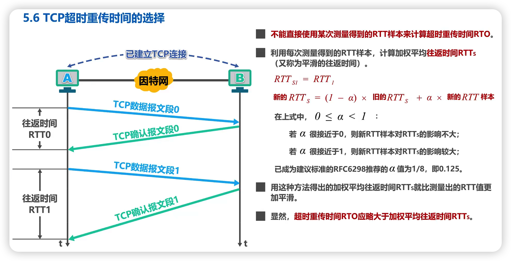

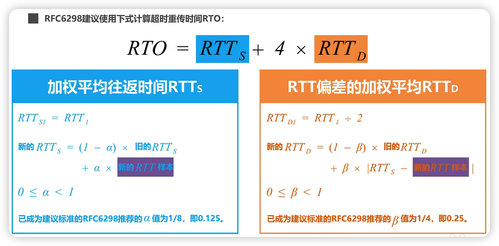

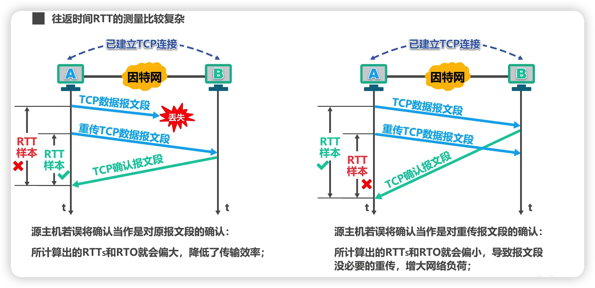

> 若出现超时重传, 则往返时间RTT会很难测量

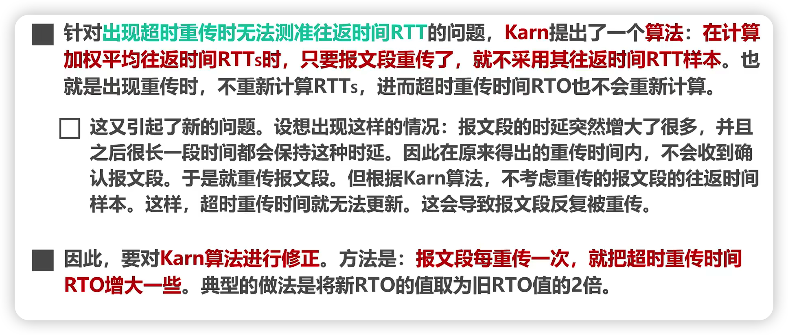

> 示例

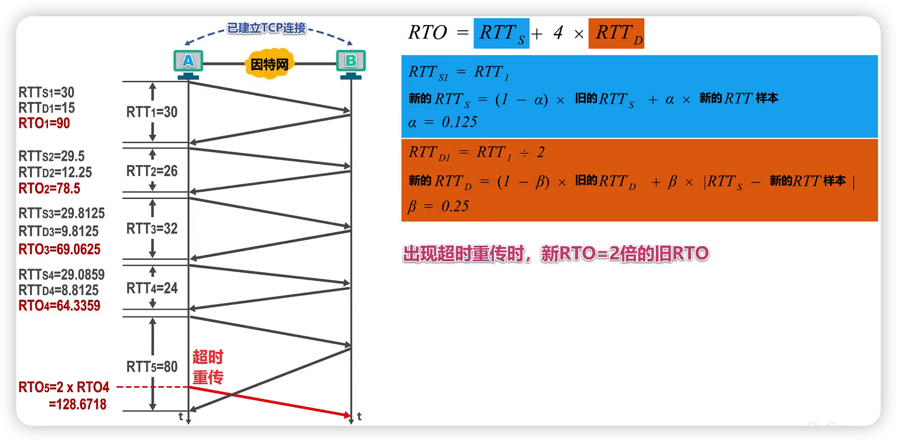

## TCP可靠传输的实现

>[5.7 TCP可靠传输的实现_哔哩哔哩_bilibili](https://www.bilibili.com/video/BV1c4411d7jb/?p=63&spm_id_from=pageDriver&vd_source=d6271710c0aa78f4d90fc3f7028b8301)

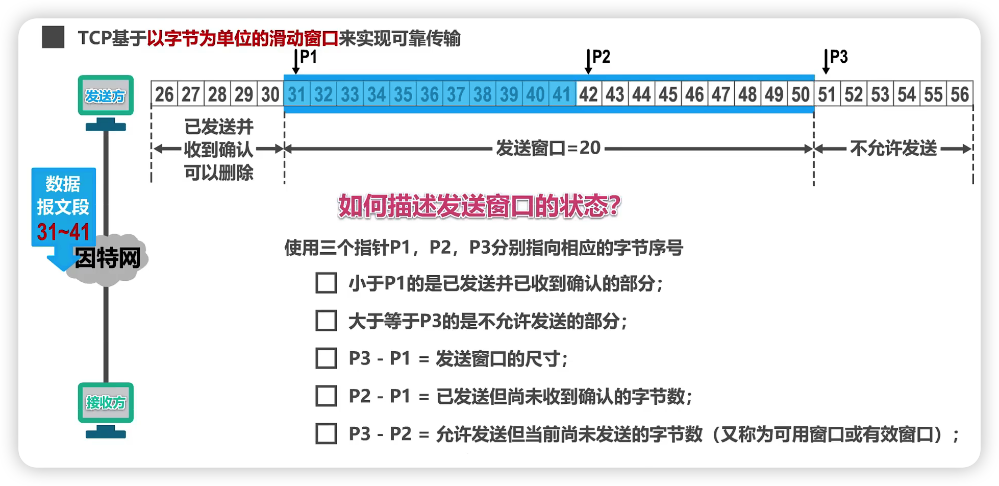

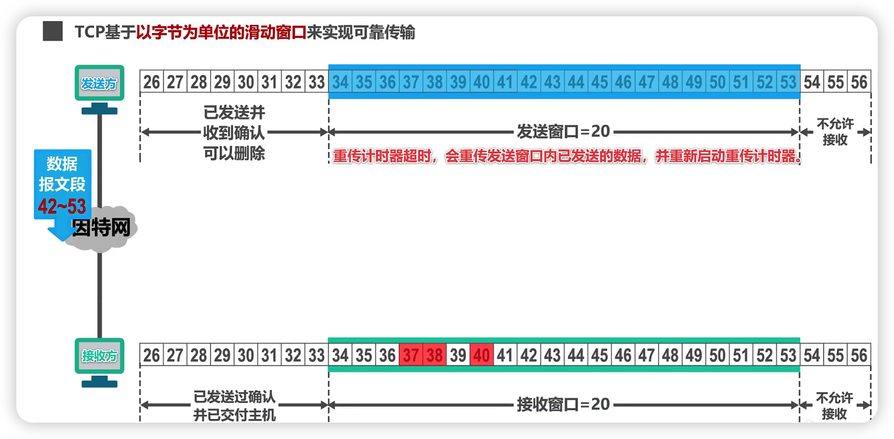

> TCP可靠传输的实现

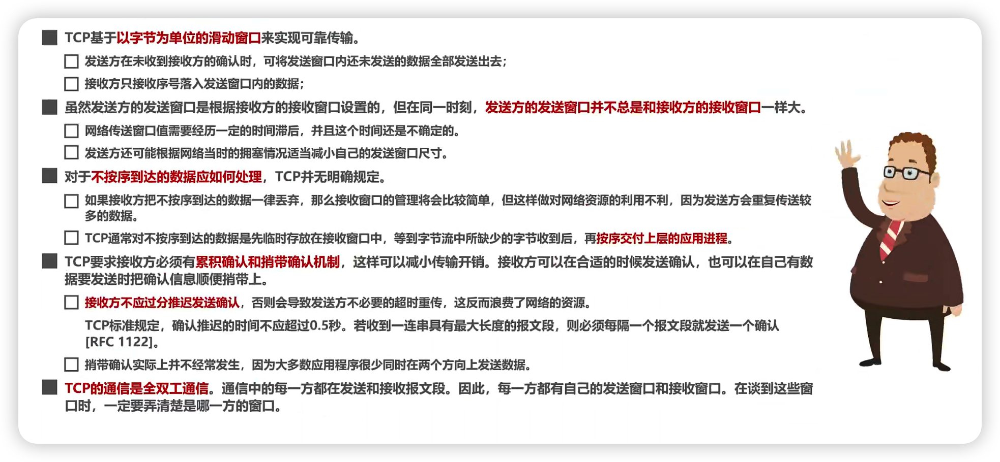

> 例题

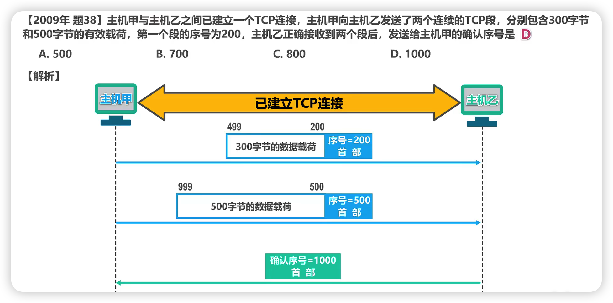

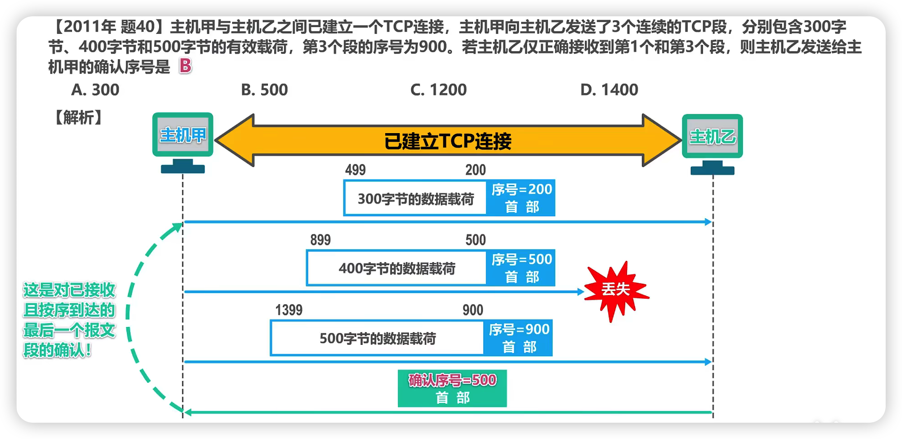

## TCP运输连接管理

### 介绍

- TCP是面向连接的协议, 它基于运输连接来传送TCP报文段
- TCP运输连接的建立和释放是每一次面向连接的通信中必不可少的过程
- TCP运输连接有三个阶段
  - 建立TCP连接「三报文握手」
  - 数据传输
  - 释放TCP连接「四报文挥手」
- TCP的运输连接管理就是使得运输连接的建立和释放正常进行

### TCP连接建立「三次握手」

> TCP连接建立要解决三个问题

- 使得TCP双方确认对方的存在
- 使得TCP双方协商一些参数 (如最大窗口值, 是否使用窗口扩大选项和时间戳选项等)
- 使得TCP双方能够运输实体资源 (如缓存大小, 链接表中的项目等) 进行分配

> 使用「三报文握手」建立连接

TCP标志位, 当标志位取1时, 对应操作才有效

- SYN「同步位」
- ACK「确认位」
- ack「确认号字段」
- seq「初始序号」
- FIN「终止标志位」:用来释放TCP连接, 表面是TCP连接释放报文段
- RST「复位标志位」:用来复位TCP连接
- 「紧急标志位」

SYN=1,ACK=1说明这是一个**TCP连接请求确认**报文段, 确认号字段ack的值是对客户端seq初时序号的确认, 确认报文段中的seq是主机乙的初始序号, 可以随意指定

- TCP标准规定, SYN=1的报文段不能携带数据, 但是要消耗掉一个序号
- 普通的确认报文段如果不携带数据, 则不消耗序号

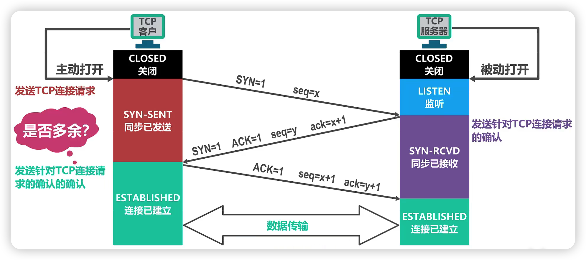

> 不能简化为两报文握手

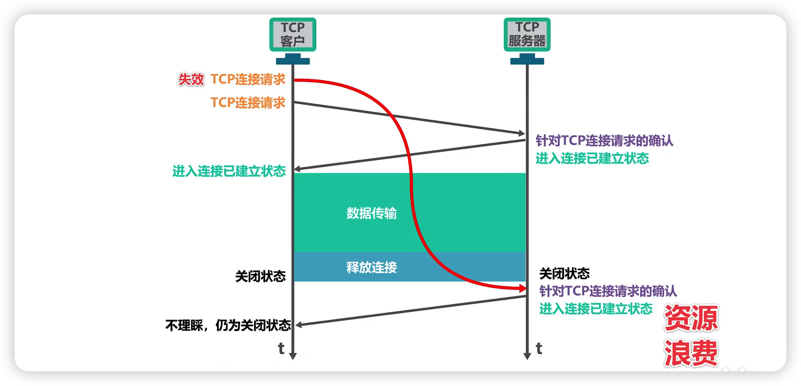

不能简化, 这是为了防止**已经失效的连接请求报文段**突然又传送到了TCP服务器, 因而导致**服务器资源浪费**

> 例题
>
> 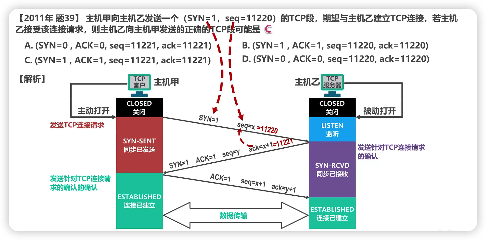

### TCP连接释放「四次挥手」

> 常规四次挥手流程

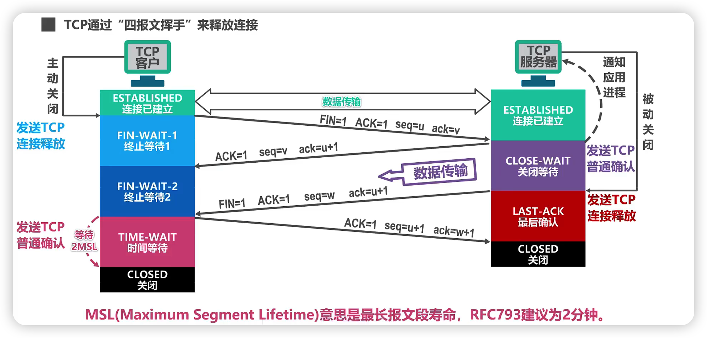

> 为什么有时间等待状态, 其目的是什么?

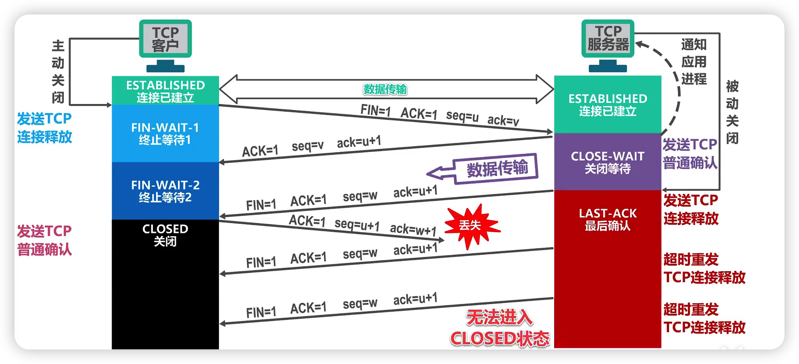

- 确保TCP服务器进程可以收到最后一个TCP确认报文段而进入关闭状态

- 使新的TCP连接中不会出现旧的报文段

> TCP客户端出现故障 => 保活计时器

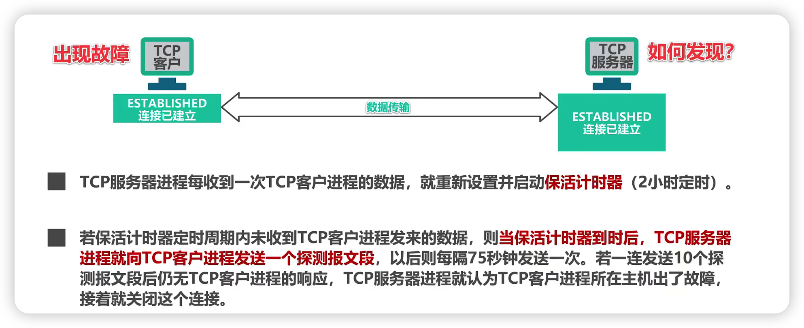

## TCP报文段的首部格式

>[5.9 TCP报文段的首部格式_哔哩哔哩_bilibili](https://www.bilibili.com/video/BV1c4411d7jb/?p=66&spm_id_from=pageDriver&vd_source=d6271710c0aa78f4d90fc3f7028b8301)

- 为了实现可靠传输, TCP采用了**面向字节流**的方式
- 但TCP在发送数据时, 是从发送缓存中取出一部分或者全部字节并给其添加一个首部使之成为**TCP报文段**后进行发送
  - 一个TCP报文段由**首部**和**数据载荷**两部分构成
  - TCP的**全部功能**都体现在它**首部中各字段**的作用

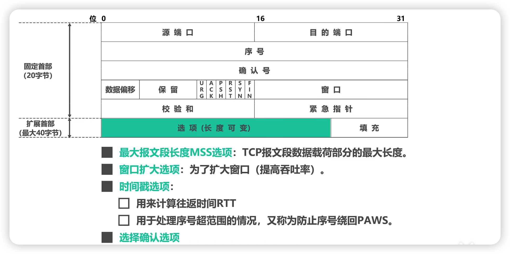

扩展首部的填充部分: 确保报文段首部能被4整除 (因为数据偏移字段, 也就是首部长度字段, 是以4字节为单位的)

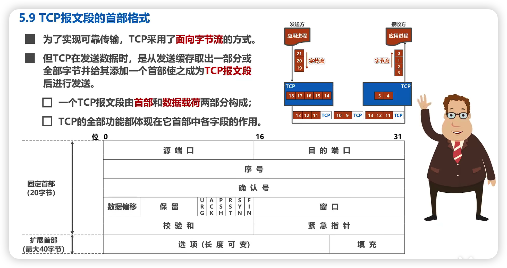

## 其他

### 单工,半双工,全双工

> 单工、半双工和全双工是三种不同的数据传输模式。

- 单工：数据只能在一个方向上传输，有固定的发送者和接收者。例如：电视、广播。
- 半双工：数据可以在两个方向上传输，但是同一时间只能在一个方向上传输，实际上是切换的单工。例如：对讲机、集线器。
- 全双工：数据可以在两个方向上同时传输，需要独立的发送端和接收端。例如：电话、交换机。

### 加密算法

> 对称加密和非对称加密算法

- 对称加密中加密和解密使用的秘钥是同一个；非对称加密中采用两个密钥，一般使用**公钥进行加密，私钥进行解密**。
- 对称加密解密的速度比较快，非对称**加密和解密花费的时间长、速度相对较慢**。
- 非对称加密可以用于**数字签名和数字鉴别**，而对称加密不可以。

你可以参考下面这个表格来比较两种算法的优缺点：

|              对称加密              |         非对称加密         |
| :--------------------------------: | :------------------------: |
|        优点：速度快、效率高        | 优点：安全性高、可用于认证 |
| 缺点：秘钥传输不安全、无法鉴别身份 |   缺点：计算复杂、速度慢   |

### 数字签名和数字鉴别

> 数字签名和数字鉴别分别用于
>
> - 保证数字信息的真实性
> - 保证数字信息完整性

| 项目           | 数字签名                                                     | 数字鉴别                                                     |
| :------------- | :----------------------------------------------------------- | :----------------------------------------------------------- |
| 定义           | 一种类似写在纸上的普通的物理签名，但是使用了公钥加密领域的技术实现，用于鉴别数字信息的方法。 | 一种利用对称加密或单向散列函数生成一个固定长度的信息摘要，附在原始信息后面，用于验证信息是否被篡改或伪造的方法。 |
| 加密方式       | 非对称加密                                                   | 对称加密或单向散列函数                                       |
| 加密和解密方法 | 私钥进行加密，公钥进行解密                                   | 秘钥或散列函数进行加密和解密                                 |
| 功能作用       | 证明信息的来源、防止抵赖和伪造。                             | 证明信息的完整性。                                           |
| 应用场景       | 电子邮件、电子合同、电子发票等都可以使用数字签名来确认发送者的身份和信息的真实性。 | 网络传输、文件存储、数据备份等都可以使用数字鉴别来验证信息是否被修改或损坏。 |

### 中间人攻击

> 攻击者作为客户端和服务器之间的桥梁、双向获取信息并且篡改其内容

中间人攻击是指攻击者通过**与客户端和目标服务器**「同时」建立连接，作为客户端和服务器的**桥梁**，处理双方的数据，整个会话期间的内容**几乎是完全**被攻击者控制的。攻击者可以**拦截双方的会话**并且**插入新的数据内容**。

中间人攻击的过程：

1. 服务器向客户端发送公钥。
2. 攻击者截获公钥，保留在自己手上。
3. 然后攻击者自己生成一个伪造的公钥，发给客户端。
4. 客户端收到伪造的公钥后，生成加密哈希（此时加密内容是对称加解密秘钥） 值发给攻击者服务器。
5. 攻击者获得加密哈希值，用自己的私钥解密获得真秘钥。
6. 同时生成假的加密哈希值，发给服务器。
7. 服务器用私钥解密获得假秘钥。
8. 服务器用假秘钥加密传输信息。
