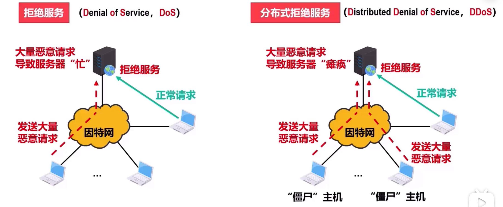
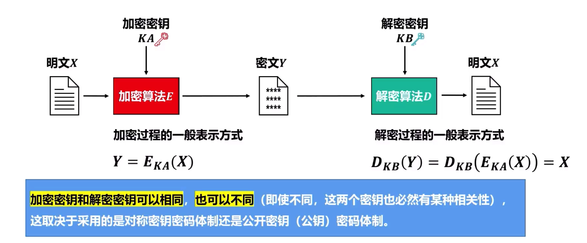
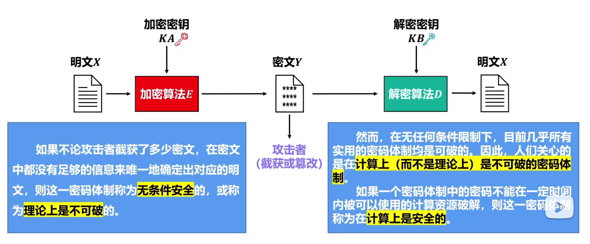
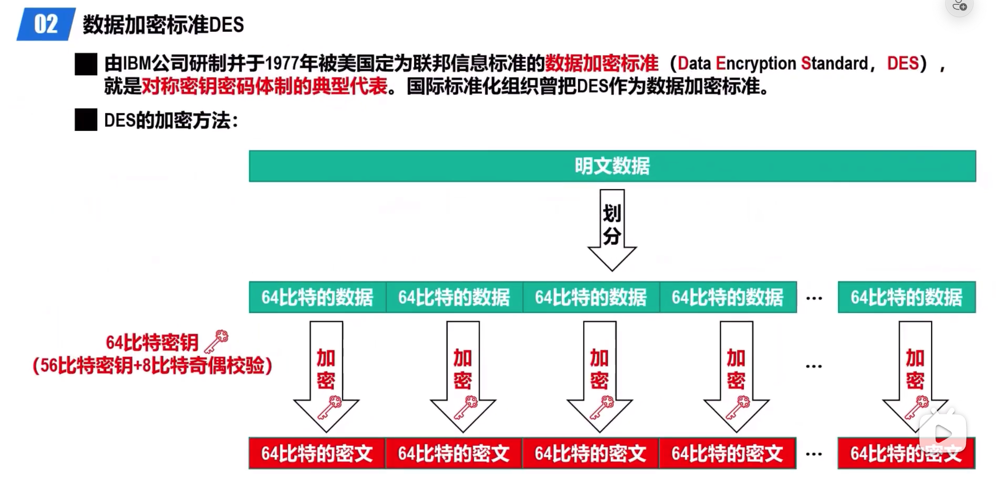

---
tag:
 - 计算机网络
---

# 网络安全

## 网络安全概述

网络安全分为安全威胁，安全服务和安全机制三方面

### 安全威胁

分为被动攻击和主动攻击

- 被动攻击：攻击者通过窃听手段仅观察和分析网络中传输数据流中的敏感信息，
  而不对其进行干扰。

- 主动攻击：攻击者对网络中传输着的数据流进行各种处理。
  - 中断
  - 篡改
  - 伪造
  - 恶意程序
    - 计算机病毒
      计算机蠕虫
      特洛伊木马
      逻辑炸弹
      后门入侵
      流氓软件
  - 拒绝服务攻击（Dos）
    - 

对于被动攻击：由于其不涉及对数据的更改，很难被发现，因此对付被动攻击主要采用各种数据加密技术进行预防，而不是主动检测。

对于主动攻击：由于主动攻击**容易检测**。对付主动攻击除要采取**数据加密技术**、访问控
制技术等**预防措施**，还需要采取**各种检测技术**及时发现井阻止攻击，同时还要对攻击源进行
追踪，井利用**法律手段**对其进行打击。

### 安全服务

| 安全服务   | 作用                                                   | 对付攻击           |
| ---------- | ------------------------------------------------------ | ------------------ |
| 保密性     | 确保网络中传输的信息只有其发送方和接收方才能懂得其含义 | 对付被动攻击       |
| 报文完整性 | 确保网络中传输的信息不被攻击者篡改或伪造               | 对付主动攻击       |
| 实体鉴别   | 通信两端的实体能够相互验证对方的真实身份               | 对付主动攻击       |
| 不可否认性 | 防止发送方或接收方否认发送或接收过某信息               | 保护电子商务       |
| 访问控制   | 对实体的访问权限进行控制                               | 防止未授权实体访问 |
| 可用性     | 确保授权用户能够正常访问系统信息和资源                 | 拒绝服务攻击       |

## 对称加密与非对称加密

### 密码学基本概念

将发送的数据变换成对任何不知道如何做逆变换的人都不可理解的形式，从而保证数据的机密性，这种变换称为加密 (Encryption)

- 加密前的数据被称为明文 (Plaintext)
- 加密后的数据被称为密文 (Ciphertext)

通过某种逆变换将密文重新变换回明文，这种逆变换称为解密(Decryption)

加密和解密过程可以使用密钥（Key）作为参数。

- 密钥必须保密，但加密和解密的过程可以公开。
- 只有知道密钥的人才能解密密文，否则即使知道加密或解密算法也无法解密密文。

>为什么依靠密钥进行保密而不依靠密码算法进行保密呢？

- 一旦算法失密就必须放弃该算法，这意味着需
  要频繁地修改密码算法，而开发一个新的密码
  算法是非常困难的事情。
- 密钥空间可以很大，用密钥将密码算法参数化，
  同一个密码算法可以为大量用户提供加密服务。

### 对称密钥密码体制

对称密钥密码体制是指加密密钥与解密密钥相同的密码体制。
数据加密的一般模型使用对称密钥

数据加密标准的发展：

> DES->三重DES->高级加密标准ANS

**高级加密标准AES**

- 高级加密标准(Advanced Encryption Standard， AES)支持128比特、192比特和256比比特的密钥长度，用硬件和软件都可以快速实现。
- AES不需要太多内存，因此适用于小型移动设备。
- 据美国国家标准与技术研究院NIST估计，如果用1秒即可破解56比特密钥长度的DES的计算机，来破解128比特密钥长度的AES密钥，要用大约149万亿年的时间才有可能完成破解。

### 公钥密码体制

