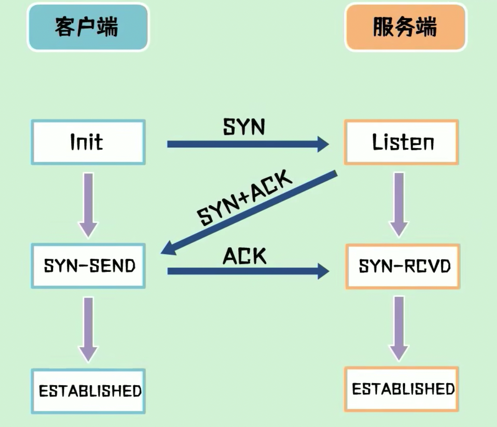
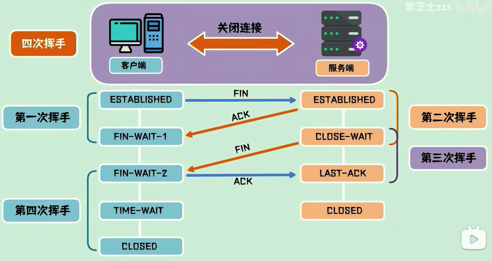

---
tag:
 - 计算机网络
---

## 网络体系

实际使用的是应用层，传输层，网络层和网络接口层

在五层协议中，是把TCP/IP的网络接口层重新划分为了物理层和数据链路层

在OSI七层协议中，是把TCP/IP的应用层划分为了会话层，表示层和应用层

### OSI七层

## 应用层

### 状态码

https://http.devtool.tech/ 「强烈推荐：状态码速查」

## 传输层

传输层主要作用：建立端到端的连接，比如我们的客户端到服务端就是端到端

### TCP为什么要三次握手？

- 面向连接
- 可靠
- 面向字节流
- 全双工

首先，明确三次握手的过程

三次握手是为了防止已经失效的请求报文，突然又传到服务器引起错误，防止由于网络滞留重发SYN包的情况

本质来说，三次握手是为了解决网络信道不可靠的问题，为了在不可靠的信道上，建立起可靠的连接

### 四次挥手

保证对方已收到ACK 包，假设客户端送完最后一包 ACK包后就释放了连接，一旦ACK包在网络中丢失，服务端将一直停留在最后确认状态

为了在不可靠的信道上，建立起可靠的连接断开确认

## 网络层

## 网络接口层

- arp协议：
  - ARP广播报文，询问设备的mac地址

在 JavaScript 中，this 关键字用于引用当前执行函数的对象。this 的值取决于函数的调用方式。this 可能是任何东西，这取决于它出现在代码中的上下文。

## 缓存

强制缓存和协商缓存是 HTTP 缓存机制中的两种不同方式。它们有以下异同点：

|              | 强制缓存                                                     | 协商缓存                                                     |
| ------------ | ------------------------------------------------------------ | ------------------------------------------------------------ |
| 说明         | 浏览器在请求资源时，直接从本地缓存中获取，不向服务器发送请求 | 浏览器在请求资源时，向服务器发送请求，根据服务器返回的响应头信息来判断是否从本地缓存中获取 |
| 缓存过期时间 | 由 Cache-Control 和 Expires 响应头控制                       | 由 Last-Modified 和 ETag 响应头控制                          |
| 缓存命中     | 命中缓存时，请求不会发到服务器                               | 命中缓存时，请求会发到服务器，但服务器会返回 304 Not Modified 状态码，告诉浏览器可以使用本地缓存 |
| 更新缓存     | 无法立即更新缓存，除非强制刷新或过期时间到了                 | 可以通过服务器控制缓存的更新，根据需要返回新的资源或 304 状态码 |

需要注意的是，虽然强制缓存和协商缓存是不同的缓存方式，但它们并不互斥。在浏览器缓存机制中，通常会先使用强制缓存，如果缓存过期或者需要强制刷新，再使用协商缓存。

## 简单请求和复杂请求

简单请求和复杂请求是指浏览器在**发送跨域请求时**，根据请求的方式、请求头和数据等内容，进行的一种分类。

简单请求满足以下条件：

1. 请求方式为 GET、HEAD、POST 中的一种。
2. 请求头只包含 Content-Type、Accept、Accept-Language、Content-Language、Content-Encoding、Last-Event-ID 中的一种或几种。
3. Content-Type 只能是下面三种类型之一：
   - text/plain
   - multipart/form-data
   - application/x-www-form-urlencoded
4. 请求中的任意 XMLHttpRequestUpload 对象均没有被使用。

> 如果请求不满足上述所有条件，则被认为是复杂请求。

复杂请求需要在正式请求前，先发送一个 OPTIONS 请求，称为“预检请求”。预检请求的作用是询问服务器，是否允许跨域请求。如果服务器允许，才会发送正式请求。预检请求中包含了一个 Access-Control-Request-Headers 头部，标明了实际请求中会使用的自定义头部字段。

在实际请求中，还需要添加一个 Origin 头部，表示请求的源地址。服务器在响应时，需要添加一个 Access-Control-Allow-Origin 头部，表示允许跨域请求的源地址。同时，还需要添加一个 Access-Control-Allow-Credentials 头部，表示允许携带凭证信息（如 Cookie）。

需要注意的是，跨域请求存在一定的安全风险，因此必须在服务器端进行一定的安全措施，如限制跨域请求的来源、仅允许特定的请求类型等。

## PUT请求

PUT 请求方法通常用于更新服务器上的资源。PUT 请求可以覆盖服务器上的指定资源或者创建一个新的资源。PUT 请求的语义是幂等的，即多次请求相同的 URL，返回的结果是一致的，不会对资源造成影响。

PUT 请求的操作过程如下：

1. 客户端向服务器发送一个 PUT 请求，请求修改指定的资源。
2. 服务器返回一个状态码表示请求的成功或失败。
3. 如果请求成功，服务器将修改后的资源存储在指定位置。

需要注意的是，PUT 请求通常用于修改整个资源，而不是部分资源。如果需要修改部分资源，可以使用 PATCH 请求。

此外，PUT 请求还有一些限制。PUT 请求的请求体中应该包含完整的修改后的资源，因此客户端必须知道修改后的资源是什么。如果客户端不知道修改后的资源是什么，就应该使用 POST 请求。另外，PUT 请求通常需要进行身份验证，以确保只有授权用户才能修改资源。
