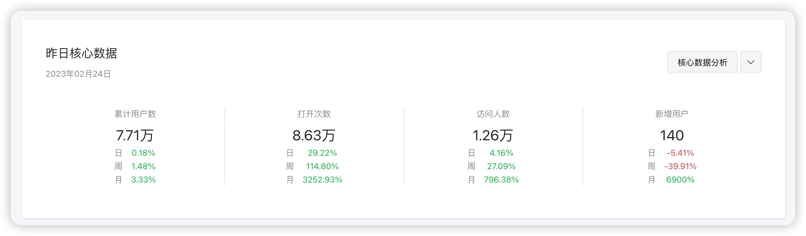
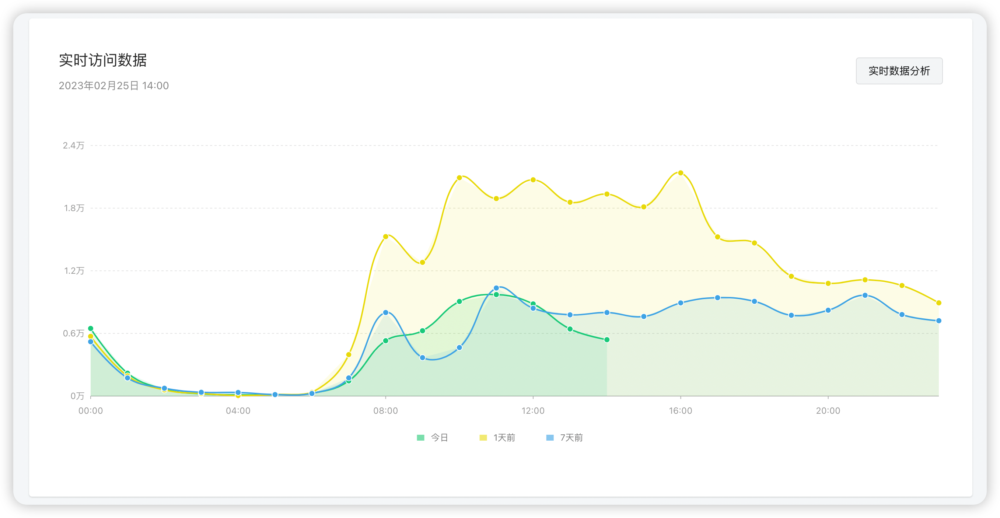
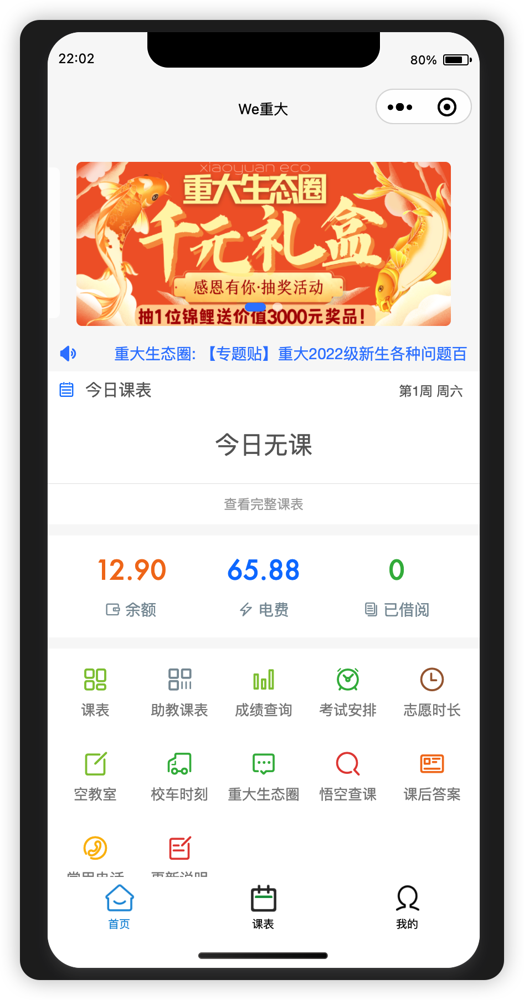
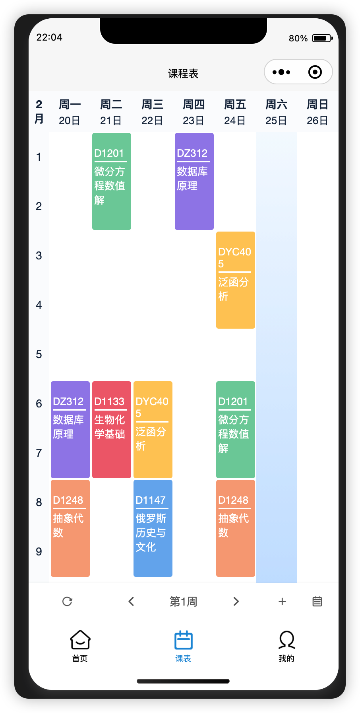
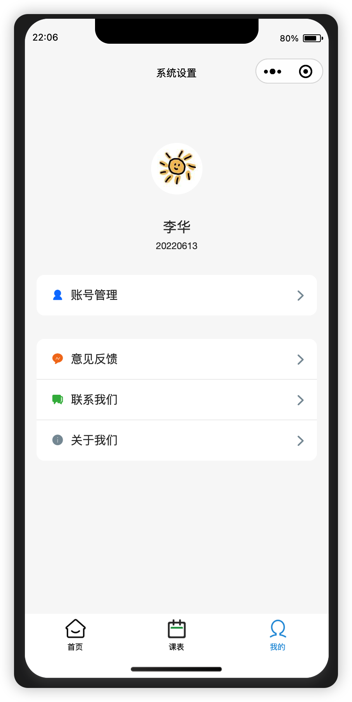
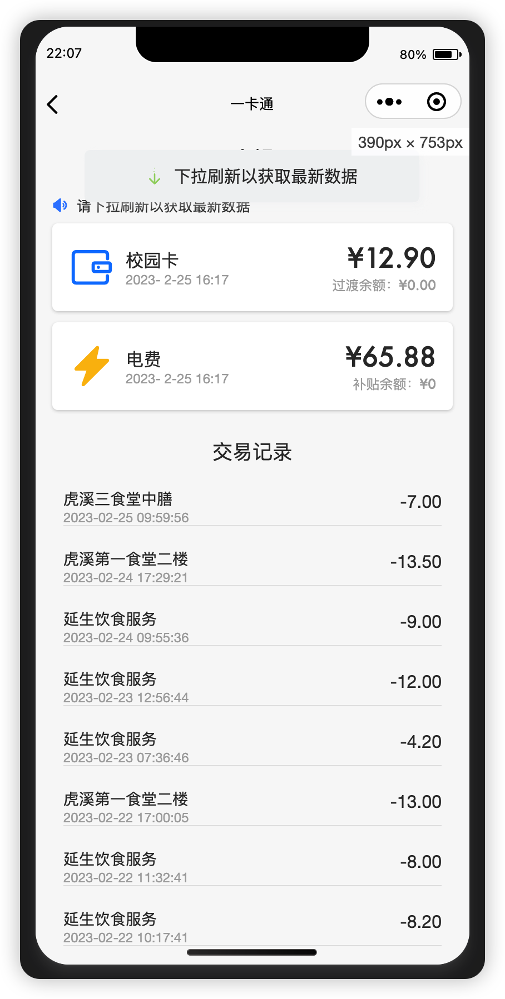
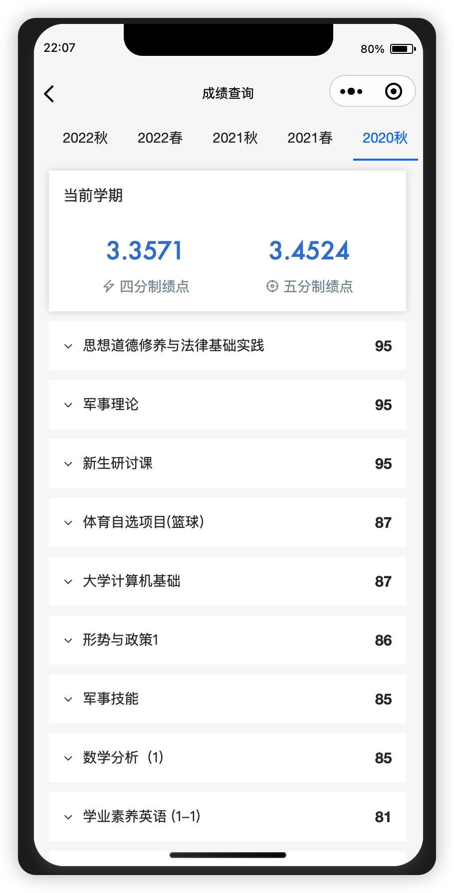
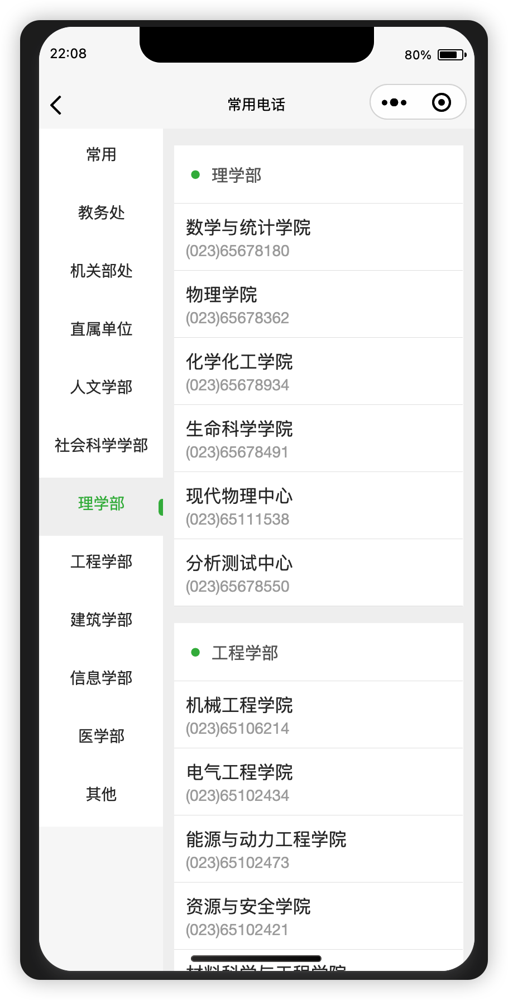

---
tag:
 - Project
---

# WeCQU微信小程序

> Uniapp + GraceUI 5
> 用户画像：在校大学生

## 项目介绍

我们的项目是一个智慧校园一体化查询微信小程序，专为大学生打造，旨在提高学生在校内的信息查询效率。

具体的实现方式是利用”微信小程序+后端“的技术，实现了一次登录，多次查询的功能，无需每次都输入账号和密码，也无需繁琐的点击操作，只需简单地访问想要查询的页面，就能快速得到结果。

## 项目数据

> 单日累计打开次数约10万+，单日访问人数1万+

## 页面展示

> 这里仅展示一些用户使用频率较高的页面

### 1.首页

### 2.课表

### 3.账户中心

### 4.一卡通与电费

### 5.成绩单

### 6.常用电话

## 核心功能

- 课表查询🔥
- 成绩查询🔥
- 校园卡余额与消费记录查询🔥
- 考试安排查询
- 志愿时长查询
- 空教室查询
- 校车时刻查询
- 历届课程信息查询
- 常用电话查询

## 我的工作⛱

> 持续时间：2022.9 - 至今

- 页面

  - 使用GraceUI组件库, 进行页面UI的重构, 重构率约**40%**
  - 对组件库中的轮播图组件进行二次封装，实现点击跳转webview页面的功能

- 逻辑

  - 优化原有的javascript逻辑, 进行部分页面逻辑的重写, 重写率约**50%**
  - 封装部分工具类函数, 例如:
    - 使用promise封装wx.request, 避免回调地狱的产生
    - 使用promise封装wx.showModal请求, 简化模态对话框的使用方式
    - 封装将临时图片转换为base64图片的函数, 获取用户头像时调用
  
  - 通过变量加锁的方式防止用户多次发起登录请求, 减轻服务器压力
  - 通过setStorage和getStorage方式实现数据持久化，包括base64用户头像的存取，课表数据的存取等
  

## 前端特色

- 充分利用微信小程序提供的 API
  -  微信小程序本身目录结构非常的清晰，分为四种主要的文件类型 .wxml/.wxss/.js/.json
  - 第一类文件主要是类似于 html 的页面结构
  - 第二类文件是类似于 CSS 的样式文件
  - 第三类文件是传统的 js 文件，但是在这个 js 文件中会 实例化一个 Page 对象作为入口函数，
  - 第四类文件是配置文件
  - 此外，微信小程序提供很多已经包装好的函数，例如 Loading加载动画，request 请求等等。 

- Promise 无阻塞请求
  - 由于一个页面中存在类似于课表信息，一卡通信息等许多类型的数据需要请求
  - 如果同时使用串行函数请求，会有阻塞发生
  - 为了避免这种情况， 我们引入了 es6 中的 Promise 函数，将每一个请求包装成一个 Promise 对象，然后并行无阻塞请求，这样就不会发生，一个请求等另一个请求这种影响性能的情况。 

- 针对通用函数采用了工具包的形式， 工具包使用的是模块化接口设计对外提供访问函数, 将通用逻辑统一封装到utils工具文件夹下, 页面逻辑中直接导入使用即可
- 采用前后端完全分离的模式, 后端只需要向前端提供接口即可
