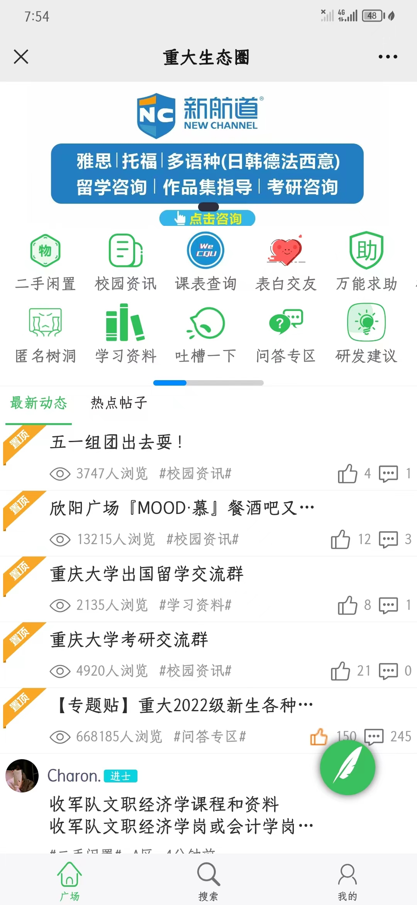
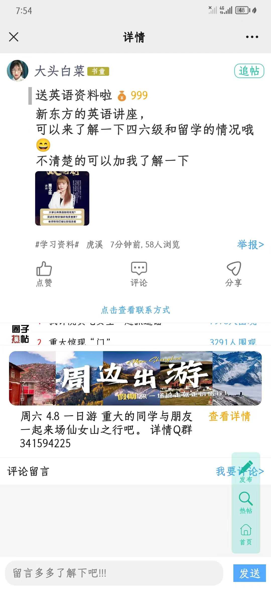
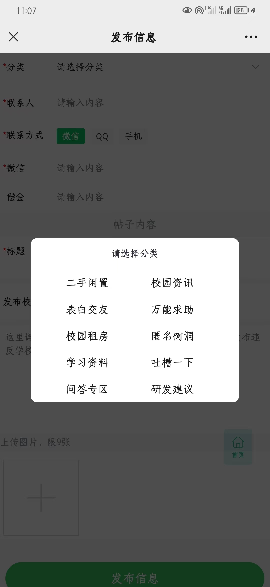
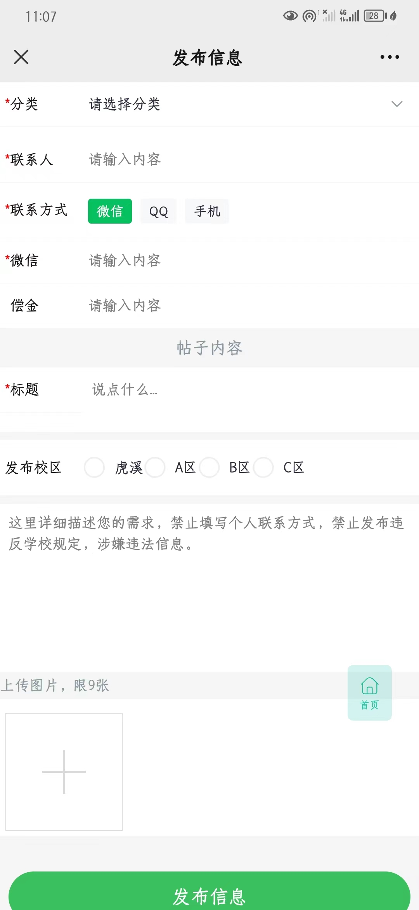
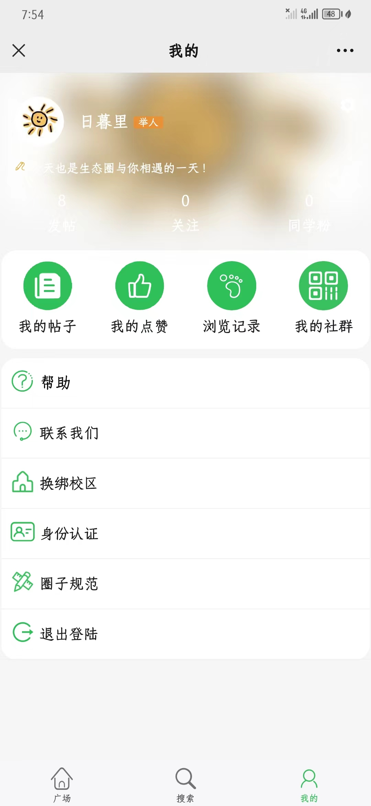
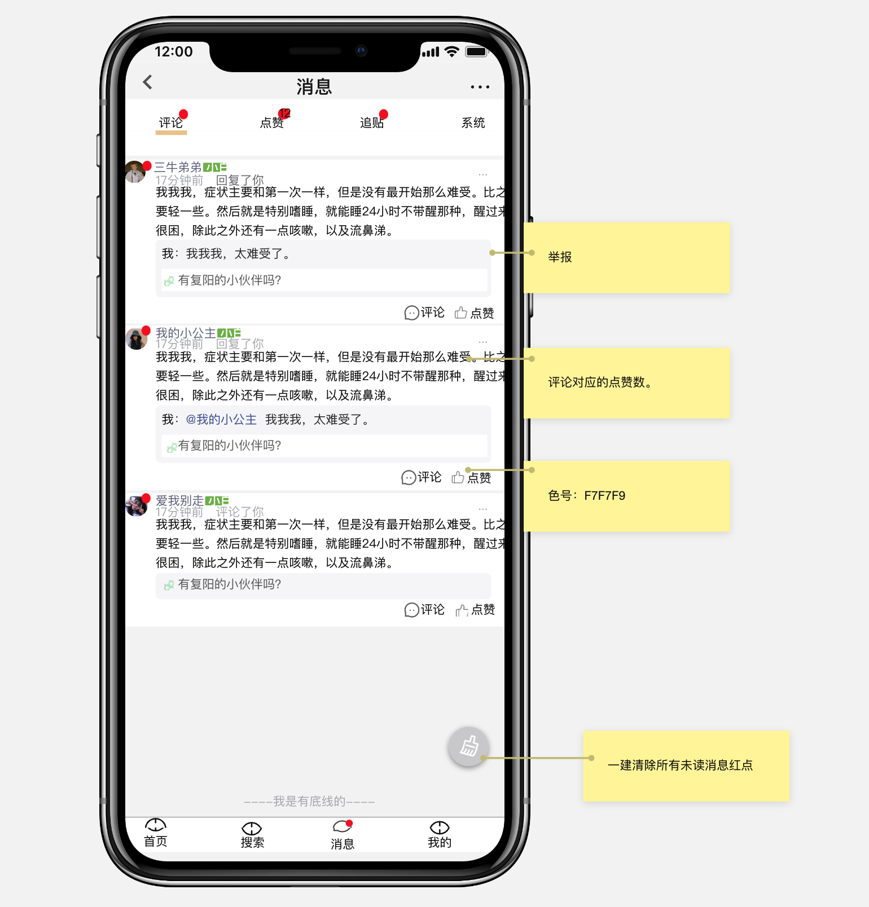
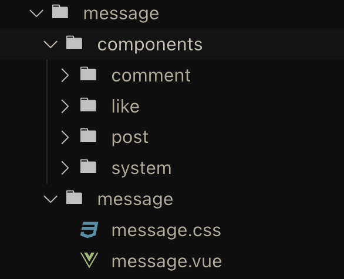

---
tag:
 - Project
---

# 校园生态圈

> Uniapp + GraceUI 5

## 项目效果

1. 首页



2. 帖子详情



3. 发帖





4. 个人中心



## 消息界面



### 起因

生态圈论坛作为一个UGC平台，帖子发布和消息通知是形成一个完整的闭环用户体验的必要组件。而目前生态圈仅支持微信H5的消息通知（通过服务号消息推送实现），而在微信 H5和QQ H5都没有内置消息通知模块。为了完善信息的体验，因此需要构建用户的消息接收功能。

### 项目层级



### 红点逻辑

底部tab栏的红点>顶部tab栏的红点>每条消息的红点

vuex中：

vuex里定义四个列表，分别是comments, likes, posts, systems

用来存放对应的消息通知

消息列表在进入h5时向后端请求数据

```vue
getters: {
  redPot: state => {
    let index1 = state.comments.findIndex(item => item.checked === false)
    let index2 = state.likes.findIndex(item => item.checked === false)
    let index3 = state.posts.findIndex(item => item.checked === false)
    let index4 = state.systems.findIndex(item => item.checked === false)
    if (index1 === -1 && index2 === -1 && index3 === -1 && index4 === -1) {
      return false
    } else {
      return true
    }
  }
}
```

message页面中：

```vue
watch: {
  redPot: {
    handler(newVal, oldVal) {
      console.log("redPot", newVal)
      if (newVal === false) {
        uni.hideTabBarRedDot({ //隐藏红点
          index: 2
        })
      } else {
        uni.showTabBarRedDot({ //显示红点
          index: 2
        })
      }
    },
    immediate: true
  }
},
```

### 亮点

> component标签+KeepAlive标签，降低了顶部tab栏的切换开销
>
> - `<component>`是一个用于渲染**动态组件**或元素的“元组件”
> - `<KeepAlive>` 是一个内置组件，它的功能是在多个组件间动态切换时缓存被移除的组件实例。

component标签的核心就是动态绑定，项目通过动态绑定is属性的方式, 用来切换不同组件的显示或隐藏

当使用 `<component :is="...">` 来在多个组件间作切换时，被切换掉的组件会被卸载，当频繁切换时会产生不必要的渲染开销。我们可以通过`KeepAlive`强制被切换掉的组件仍然保持“存活”的状态。

```vue
<KeepAlive>
  <component :is="curComponent"></component>
</KeepAlive>
```

